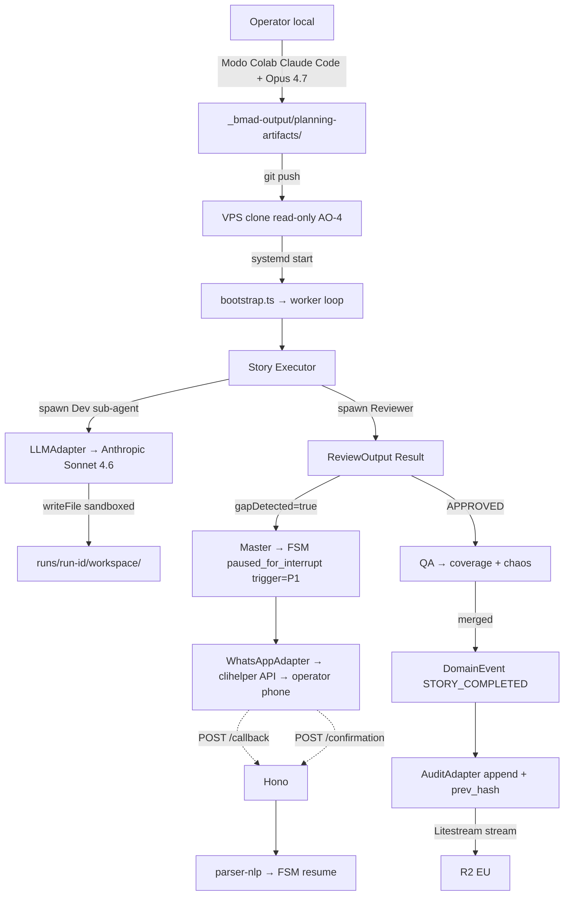

# Architecture Decision Document — HORSE DRIVEN DEVELOPMENT (HDD)

_Documento construído colaborativamente através de descoberta passo-a-passo. Secções são adicionadas à medida que percorremos cada decisão arquitetural._

## 0. Inputs canónicos (Step-01 init)

**Brief autoritativo** (`brief-projeto_hdd-2026-05-20/brief.md`):
- Pipeline bimodal: Modo Colaborativo (Fases BMAD 1-2 no Claude Code local) + Modo Autónomo (Fases 3-4 no worker OpenClaw em VPS própria)
- Canal de interrupt: **WhatsApp** (sistema proprietário) + fallback automático e-mail (S3)
- Regra de interrupt: 1 trigger primário (P1: gap código↔PRD/Arq) + 3 watchdogs (S1 timeout 30min, S2 5 falhas reincidentes, S3 canal indisponível)
- Gates de qualidade nos handoffs: PRD→Arq, Story→Dev, Dev→Review, Review→QA
- 3 princípios não-negociáveis (P-1/P-2/P-3 — vide PRD §3.1)

**PRD v2** (`prd-projeto_hdd-2026-05-20/prd.md` — final, D-030 approved):
- 9 features (FR-001..084) cobrindo pipeline bimodal, regra de interrupt, canal WhatsApp+fallback e-mail, worker em VPS, state store + idempotência, gates de qualidade, gestão de janela LLM, Resumo de Finalização 3-tier, bootstrap.
- NFRs: Segurança, Confiabilidade, Observabilidade, Performance, Manutenibilidade, Usabilidade, Compliance.
- 14 entradas no Assumptions Index, 11 Open Items.

**8 Open Questions herdadas para esta arquitetura** (ver frontmatter `openQuestionsFromPRD`).

**Pré-requisitos confirmados:**
- ✅ BMAD v6.7.1 instalado
- ✅ Claude Code + Opus 4.7 1M
- ✅ Anthropic Max 20x activo
- ⚠️ VPS própria (a validar acesso e recursos durante esta arquitetura)
- ⚠️ Número WhatsApp aprovado no sistema próprio (a documentar API interna)
- ⚠️ Conta SMTP/transacional (provider a decidir aqui — OQ-F)
- ❌ Plugin `BMAD_Openclaw` (a instalar no worker)

---

---

## Project Context Analysis

### Requirements Overview

**Functional Requirements:** ~87 FRs em 9 features (PRD v2 §7), com **+3 FRs novos da elicitação** (FR-026 templates Meta, FR-027 janela 24h, FR-028 cost cap conversation; FR-085 heartbeat proactivo).

- **F1 Pipeline bimodal** (FR-001..006): orquestração local↔VPS, gate Readiness, BMAD invoker CLI-wrapper.
- **F2 Regra de Interrupt** (FR-010..017): P1+S1+S2+S3, FSM explícita com queue, gap detector "ask-the-agent".
- **F3 Canal WhatsApp Cloud API oficial Meta + fallback e-mail** (FR-020..028): templates pré-aprovados, janela 24h, `X-Hub-Signature-256`, idempotency `biz_opaque_callback_data`, cost cap.
- **F4 Worker autónomo em VPS** (FR-030..034): Node runtime, CLI `hdd-worker`, crash recovery.
- **F5 State store + idempotência** (FR-040..044): SQLite persistente off-host backup, idempotência LLM-aware (hash de artefacto), audit JSONL com `prev_hash` chain.
- **F6 Gates de qualidade nos handoffs** (FR-050..052): 4 gates explícitos com diagnóstico estruturado.
- **F7 Gestão de janela LLM** (FR-060..065): dual-mode Max 20x + API (D-050), alertas 50/70/80% + cost cap USD, pacing; multi-modelo selection **diferido v1.1** (decisão da elicitação).
- **F8 Resumo de Finalização 3-tier** (FR-070..076): Tier-A via templates Meta; drift detector Tier-A↔B.
- **F9 Bootstrap & operação** (FR-080..085): setup, prereq check, fail-closed, **FR-085 heartbeat proactivo** (novo da elicitação).

**Non-Functional Requirements:**
- **Segurança (S):** vault para secrets, redaction logs, sandbox dev com `--network none` (uid dedicado + Docker/chroot), label `human-review-required` + branch protection com required reviews para superfícies sensíveis, `X-Hub-Signature-256` nativa Meta, audit log com hash chain.
- **Confiabilidade (R):** crash recovery, retry exponencial, serialização, **idempotência LLM-aware** (hash artefacto + commit-state-before-side-effect), pipeline NÃO pára em S3.
- **Observabilidade (O):** state ≤2s, audit JSONL append-only com `prev_hash` + rotação diária + sync remoto, métrica interrupts-pendentes, alertas 50/70/80% janela LLM.
- **Performance (P):** cold start ≤30s, latência interrupt→mensagem ≤10s — calibrar.
- **Manutenibilidade (M):** versões pinadas BMAD + plugin BMAD_Openclaw + libraries (com hash integrity).
- **Usabilidade (U):** resposta por telemóvel, Tier-A ≤200 palavras (cabe em template Meta), CLI worker com --help, **parser NLP-tolerante** de respostas livres ("ok"/"muda X"/"não" → approve/request_changes/reject).
- **Compliance (C):** diferido v1.1+.

**Scale & Complexity:**
- Sistema distribuído local+remoto com handoff bimodal via `context-bundle.json` imutável + hash.
- Async event-driven (interrupts P1/S1/S2 + webhook Cloud API + watchdogs).
- Single-operator, single-project, single-story-at-a-time no v1; worker em workspace isolado `/var/lib/projeto_hdd/runs/<run-id>/` (não no root).
- 10-12 componentes arquiteturais estimados.
- Primary domain: **backend / devtools / infra** (internal platform).
- Complexity level: **medium-high**.

### Technical Constraints & Dependencies

**Constraints rígidos (decisões consolidadas):**
- Anthropic single-provider (D-017) — sem multi-provider. Acesso **dual-mode** (D-050): Max 20x (planejamento interativo + fallback/overflow) + API pay-per-token (implementação autónoma, default). Sem multi-modelo automático no v1 (T1 resolvido).
- Stack OpenClaw + plugin `ErwanLorteau/BMAD_Openclaw` (decidido brief).
- BMAD v6.7.1 pinado (`_bmad/_config/manifest.yaml`).
- **WhatsApp Cloud API oficial Meta** (D-031 override) — sub-decisão Meta directa vs BSP pendente.
- Saídas em português (`document_output_language=Portuguese`).
- VPS própria para Modo Autónomo.
- Claude Code + Opus 4.7 1M para Modo Colaborativo.

**Dependências externas (com hash pinning):**
- Plugin `BMAD_Openclaw` (a instalar; CLI-wrapper como interface).
- **WhatsApp Cloud API Meta** (direct ou BSP) — substitui Baileys/whatsapp-web.js.
- E-mail provider: **Resend** (default) com delivery webhook.
- Anthropic API com Max 20x.
- SQLite local + `rclone` para backup off-host (S3/R2).
- GitHub PAT fine-grained (1 repo, sem admin) + branch protection.

**Pré-requisitos por validar antes do M1:**
- Acesso SSH + recursos da VPS (CPU/RAM para worker Node + SQLite + audit logger).
- **WABA + número Meta-certificado + app Meta for Developers + templates submetidos** (aprovação dias-semanas — começar imediatamente).
- Credenciais Resend + domínio verificado.

### Architectural Obligations (derivadas da elicitação Step 02)

| # | Obrigação | Origem |
|---|---|---|
| **AO-1** | `context-bundle.json` imutável + hash no handoff Colab→Auton; worker NUNCA lê artefactos vivos directos do local | Arq #1 |
| **AO-2** | FSM explícita com 6 estados lowercase (`idle`, `running`, `paused_for_interrupt`, `paused_awaiting_review`, `paused_window_exhausted`, `failed`) — ciclo principal `running → paused_for_interrupt → running` consolidando os 4 PAUSED por trigger (P1/S1/S2/S3) num único estado com `trigger` carregado em metadata separada; novos triggers enquanto qualquer estado PAUSED entram em queue, não sobrepõem. Canon ratificado em Story 1.a.4 (commit `48a9a3a`) | Arq #2, Pre-mortem #5, Story 1.a.4 Q-A4-1 |
| **AO-3** | Idempotência LLM-aware: hash do artefacto gerado verificado antes de qualquer commit | Arq #3, Pre-mortem #3 |
| **AO-4** | Planning artefacts read-only no VPS; sync Git unidireccional VPS→local no fim de cada story | Arq #4 |
| **AO-5** | Gap detector como camada plugável (interface `GapDetector`); default = ask-the-agent com structured boolean output + hit-rate metric | Arq #5, PM #3, Pre-mortem #2 |
| **AO-6** | Branches `story/<id>` sempre; rollback = delete-branch (não git revert) | Arq #6, PM #2 |
| **AO-7** | WhatsApp Cloud API session health-check distinto de S3; quality rating monitorizado | Arq #7 (revisto D-031), Security #1 |
| **AO-8** | State store SQLite com backup off-host via `rclone` a cada checkpoint | SRE #1, Pre-mortem #6 |
| **AO-9** | 2º watchdog TTL 4h em `paused_for_interrupt=true` → escala via canal alternativo | SRE #2 |
| **AO-10** | TTL 24h também no fallback e-mail; após expirar, força pausa com flag `channel-timeout` | SRE #3 |
| **AO-11** | `X-Hub-Signature-256` nativa Meta + `wa_id` allowlist (não HMAC custom) | Security #1 (revisto D-031) |
| **AO-12** | Sandbox Dev agent: uid dedicado + Docker `--network none` durante geração; rede mínima reabre em CI | Security #2 |
| **AO-13** | GitHub PAT fine-grained 1 repo + branch protection com required reviews em superfícies sensíveis | Security #3, #6 |
| **AO-14** | Audit JSONL com `prev_hash` chain + `O_APPEND` syscall + rotação diária + sync remoto | Security #4, SRE #7 |
| **AO-15** | Supply chain: pin de versões exactas com hash integrity (BMAD_Openclaw, Cloud API SDK, etc.) | Security #5 |
| **AO-16** | Worker como utilizador não-privilegiado `hdd-worker` + systemd EnvironmentFile 0600 para secrets | Security #7 |
| **AO-17** | Webhook listener com rate-limit (nginx/caddy) + IP allowlist + signature verification | Security #8 |
| **AO-18** | Workspace isolation no meta-dogfood: worker corre em `/var/lib/projeto_hdd/runs/<run-id>/`, não no root | PM #7 |
| **AO-19** | Parser de respostas NLP-tolerante (LLM-based) — não string matching rígido | PM #5 |
| **AO-20** | Heartbeat externo (Healthchecks.io) + **heartbeat proactivo via WhatsApp template** ao operador (default 4h) — FR-085 | SRE métricas, PM #6 |
| **AO-21** | Drift detector Tier-A↔Tier-B no Resumo de Finalização + agrupamento por epic | Pre-mortem #8 |
| **AO-22** | Templates Meta upfront (`hdd_interrupt_p1`, `hdd_interrupt_s1`, `hdd_interrupt_s2`, `hdd_summary_finalization`, `hdd_heartbeat`, `hdd_release_final`) submetidos antes do M1 | D-031 (override Cloud API) |
| **AO-23** | Decisões implícitas do Modo Colab carregadas no worker via `context-bundle.json` (anti-padrões + decision-log incluídos) | Pre-mortem #9, Arq #1 |

### Cross-Cutting Concerns (refinados)

| Concern | Atravessa | Implicação |
|---|---|---|
| **Idempotência LLM-aware** | story exec, mensagens, side-effects, retries | Idempotency keys + hash artefacto + commit-state-before-side-effect |
| **State recovery off-host** | worker, state store, audit log | SQLite + `rclone` periódico + state restore ≤2s |
| **Observability append-only** | todos os componentes | JSONL com `prev_hash` chain + rotação + sync remoto |
| **Gestão de janela LLM** | cada sub-agente | Token tracker + alertas escalonados; downgrade só sob exhaustion (não routing) |
| **FSM de interrupts vs finalizações** | F2 + F8 | Estados mutuamente exclusivos + queue de triggers + TTL 4h escalation |
| **Gates de qualidade** | todos os handoffs | Diagnóstico estruturado + eventos JSONL |
| **Anti-contaminação contexto** | sub-agentes + handoff bimodal | `context-bundle.json` + workflow isolation BMad Master |
| **Async response handling Cloud API** | interrupts WhatsApp | Templates + janela 24h + `X-Hub-Signature-256` + `wa_id` allowlist |
| **Trust boundaries** | Claude Code↔Anthropic, VPS↔Meta, VPS↔GitHub, worker↔código gerado | Vault para secrets, sandbox, fine-grained PAT, signature verification |

### Cortes propostos para v1.1 (resultantes da elicitação)

- **FR-064/FR-065 selection multi-modelo** → cortar; **manter pacing** (alertas + downgrade só sob exhaustion).
- **FR-043 rollback parcial automático** → diferir; v1 = rollback manual via delete-branch (cheap, dá o necessário).
- **FR-075 diff side-by-side semântico** → diferir; v1 = git log do summary chega.
- **Rollback automático multi-story engine** → diferir v1.1+.

### Sub-decisões fechadas em Round 2 elicitation

- **D-032** ✅ ToS Anthropic Max 20x = **[ACCEPTED RISK]** — largamente **MITIGADO por D-050**: a carga pesada autónoma (impl.) usa a API oficial (ToS-compliant); risco residual só no caminho de overflow automatizado para Max 20x. Plan B LLM permanece runbook executable.
- **D-033** ✅ WhatsApp via **app proprietário do operador `clihelper.example.com`** (não Meta directa nem BSP). HDD = HTTP client simples. Templates em `whatsapp-templates-utility.md`. Rate-limit 1 req/s. Webhook inbound JSON structure TBD do operador.
- **D-034** ✅ Backup SQLite: **Litestream primário + rclone secundário** para R2 EU.

### Architectural Obligations Round 2 (AO-24..AO-46)

| # | Obrigação | Origem |
|---|---|---|
| **AO-24** | **[REFRAMED por D-050]** O switch Max 20x → API deixou de ser só plan-B de suspensão: API pay-per-token é o caminho **DEFAULT** da implementação. Runbook agora cobre o inverso — overflow/fallback impl. → Max 20x quando cost cap USD atinge limite; inclui env vars, código de seleção de modo, alerta de cap. | CDM D-017 reforçado por D-032; revisto D-050 |
| ~~**AO-25**~~ | ~~Pre-rolagem Meta paralela~~ — **DISPENSADO em D-033** (já feito do lado do operador) | — |
| **AO-26** | Chaos test do worker durante piloto (kill -9 em `runs/<id>/`; verificar workspace pai intacto) | CDM D-018 |
| **AO-27** | Timestamp externo RFC 3161 (FreeTSA) do hash-root JSONL diário OU commit em GitHub público | Compliance #4 |
| **AO-28** | TTL `retention_days=90` no audit-logger embutido desde design v1 | Compliance #1 |
| **AO-29** | DPA Anthropic executado; SCCs/região EU explícita no R2 bucket (`eu-west-1` ou Cloudflare R2 EU) | Compliance #3, #8 |
| **AO-30** | CI gate `license-checker --failOn GPL;AGPL;LGPL` no repo de produto gerado | Compliance #5 |
| **AO-31** | Template de disclosure LLM para onboarding revisor convidado v1.1+ — criar agora | Compliance #6 |
| **AO-32** | Quick Reply buttons em todos os templates Meta (3 opções: contexto-dependente; spec em `whatsapp-templates-utility.md`) | UX + D-033 |
| **AO-33** | Heartbeat `do_not_disturb_start/end` default 23h-8h; acumular fora desse horário | UX #2 |
| **AO-34** | Parser NLP com confidence threshold 0.7; abaixo disso clarificação com Quick Replies | UX #3 |
| **AO-35** | Onboarding: 1ª ocorrência de cada tipo envia parágrafo explicativo; após 3× omite | UX #5 |
| **AO-36** | Quick Reply lembrete em 20h; fallback S3 em 48h sem resposta | UX #6 |
| **AO-37** | SQLite `journal_mode=WAL` desde migração 001 | DE #1 |
| **AO-38** | **Litestream primário** (streaming WAL para R2 EU); rclone diário `.dump` secundário portável | DE #2 + D-034 |
| **AO-39** | WhatsApp idempotency key composta: `SHA-256(run_id || story_id || template_name || seq_local)` | DE #3 |
| **AO-40** | FSM persisted como tabela single-row; transitions = `BEGIN IMMEDIATE` atomic com audit append | DE #4 |
| **AO-41** | Schema migrations versionadas append-only desde v1 (nunca DROP/ALTER) | DE #7 |
| **AO-42** | **Prompt caching Anthropic SDK** no Dev agent (`cache_control: ephemeral`) — reduz ~60% tokens repetidos | FinOps tactic #2 |
| **AO-43** | Routing Haiku 4.5 para gap detector + parser NLP (não Opus/Sonnet) | FinOps tactic #1 |
| **AO-44** | Dois contadores separados: `llm_window_pct_used` e `waba_conversations_month` (este último ≈ N/A com D-033, mas manter para alertas internos do operador se ele quiser) | FinOps #4 |
| **AO-45** | **Leaky bucket rate-limit 1 req/s** no WhatsApp adapter (constraint clihelper) | D-033 |
| **AO-46** | Webhook callback URL configurável + parser inbound do app do operador (estrutura JSON TBD); parser duplo: Quick Reply payloads (`p1_*`, `fin_*`, etc., match exacto) + texto livre (NLP Haiku) | D-033 |

**Total: 45 Architectural Obligations activas (AO-1..AO-44 + AO-45..AO-46; AO-25 dispensada).**

### Schema SQLite (Data Engineer)

```sql
PRAGMA journal_mode=WAL;
PRAGMA foreign_keys=ON;

CREATE TABLE runs (
  run_id        TEXT PRIMARY KEY,
  project_id    TEXT NOT NULL DEFAULT 'projeto_hdd',
  started_at    TEXT NOT NULL,
  ended_at      TEXT,
  status        TEXT NOT NULL CHECK(status IN
    -- 6 estados canónicos per Story 1.a.4 (Q-A4-1 ratificado 2026-05-28). Story 1.a.5 implementa esta tabela.
    ('idle','running','paused_for_interrupt','paused_awaiting_review','paused_window_exhausted','failed')),
  paused_trigger TEXT CHECK(paused_trigger IN ('P1','S1','S2','S3')), -- só preenchido quando status = 'paused_for_interrupt'
  paused_review_reason TEXT,                                          -- só quando status = 'paused_awaiting_review'
  context_bundle_hash TEXT NOT NULL,
  llm_tokens_total INTEGER NOT NULL DEFAULT 0,
  schema_version INTEGER NOT NULL DEFAULT 1
);

CREATE TABLE stories (
  story_id      TEXT PRIMARY KEY,
  run_id        TEXT NOT NULL REFERENCES runs(run_id),
  status        TEXT NOT NULL CHECK(status IN ('PENDING','RUNNING','PAUSED','DONE','ROLLED_BACK')),
  current_phase TEXT,
  retry_count   INTEGER NOT NULL DEFAULT 0,
  artefact_hash TEXT,
  branch_name   TEXT,
  rolled_back_at TEXT,
  rollback_reason TEXT,
  created_at    TEXT NOT NULL,
  updated_at    TEXT NOT NULL
);
CREATE INDEX idx_stories_run ON stories(run_id, status);

CREATE TABLE fsm_state (
  run_id        TEXT PRIMARY KEY REFERENCES runs(run_id),
  fsm_current   TEXT NOT NULL,
  paused_for_interrupt INTEGER NOT NULL DEFAULT 0,
  last_interrupt_at TEXT,
  interrupt_pending_id TEXT,
  current_workflow TEXT,
  last_user_message_at TEXT
);

CREATE TABLE interrupts_pending (
  interrupt_id  TEXT PRIMARY KEY,
  run_id        TEXT NOT NULL REFERENCES runs(run_id),
  trigger_type  TEXT NOT NULL CHECK(trigger_type IN ('P1','S1','S2','S3')),
  enqueued_at   TEXT NOT NULL,
  resolved_at   TEXT,
  response_raw  TEXT,
  response_intent TEXT
);
CREATE INDEX idx_interrupts_run ON interrupts_pending(run_id, resolved_at);

CREATE TABLE idempotency_keys (
  key           TEXT PRIMARY KEY,
  story_id      TEXT NOT NULL REFERENCES stories(story_id),
  side_effect   TEXT NOT NULL,
  executed_at   TEXT NOT NULL,
  result_ref    TEXT
);

CREATE TABLE consumption_window_llm (
  run_id        TEXT NOT NULL REFERENCES runs(run_id),
  story_id      TEXT REFERENCES stories(story_id),
  tokens_used   INTEGER NOT NULL DEFAULT 0,
  model         TEXT NOT NULL,
  recorded_at   TEXT NOT NULL
);
CREATE INDEX idx_llm_run ON consumption_window_llm(run_id);

CREATE TABLE consumption_whatsapp (
  msg_id        TEXT PRIMARY KEY,
  run_id        TEXT NOT NULL REFERENCES runs(run_id),
  direction     TEXT NOT NULL CHECK(direction IN ('OUT','IN')),
  template_name TEXT,
  sent_at       TEXT NOT NULL,
  status        TEXT,
  http_status   INTEGER,
  retry_count   INTEGER NOT NULL DEFAULT 0
);

CREATE TABLE templates_meta (
  template_name TEXT PRIMARY KEY,
  tier          TEXT NOT NULL CHECK(tier IN ('A','B','C')),
  approved_at   TEXT,
  last_used_at  TEXT,
  active        INTEGER NOT NULL DEFAULT 1
);

CREATE TABLE schema_migrations (
  version       INTEGER PRIMARY KEY,
  applied_at    TEXT NOT NULL,
  description   TEXT
);
```

### Audit JSONL format (AO-14)

```json
{
  "ts":        "2026-05-20T14:32:01.123Z",
  "seq":       4712,
  "run_id":    "run-abc123",
  "story_id":  "story-007",
  "type":      "INTERRUPT_TRIGGERED",
  "trigger":   "P1",
  "payload":   { "gap_description": "..." },
  "prev_hash": "sha256:e3b0c44298fc1c149afb...",
  "this_hash": "sha256:6b86b273ff34fce19d6b..."
}
```

`this_hash = SHA-256(prev_hash || ts || seq || type || payload_canonical_json)`. `O_APPEND` syscall + atomicidade. Corrupção: truncar no último seq íntegro + restore Litestream.

---

---

## Starter Template Evaluation (Step 03)

### Primary Technology Domain
Worker daemon **Bun 1.3+ TypeScript** com 4 superfícies: CLI (`hdd-worker start|pause|resume|status|logs`), webhook HTTP server (low-volume), HTTP client outbound, long-running event loop. Não é web app, mobile, full-stack, ou backend high-throughput.

### Starter Options Considered

**Versões verificadas em May 2026 (via web research):**

| Opção | Verdict |
|---|---|
| **Bun 1.3+ + Hono** | ✅ **Escolhido** — Anthropic ownership; bun:sqlite built-in; tooling consolidation (-6 deps) |
| Node.js 22 LTS + Hono | viável (Plan B); V8 mais provado para 24/7; +6 deps fragmentadas |
| Fastify | viável (mas Hono melhor TS DX + multi-runtime) |
| Express | legacy 2026 — não justifica |
| NestJS | overkill para worker solo |
| Deno 2.0 | viável mas ecosistema menor; comunidade dispersa |

### Selected Starter: `bun create hono@latest hdd-worker --template bun`

**Rationale para selecção (D-035):**
1. **Anthropic é dona do Bun** desde 2026 — Bun é infra oficial Claude Code; HDD usa @anthropic-ai/sdk → alinhamento estratégico forte
2. **Tooling consolidation:** `bun test` + `bun build` + `bun run` + `bun:sqlite` substituem 4 ferramentas separadas (Vitest, tsc, tsx, better-sqlite3)
3. **Cold start 8-15ms** (vs Node 60-120ms) — irrelevante para daemon, relevante para CI e restart de emergência
4. **Zero N-API:** `bun:sqlite` nativo elimina dependência de node-gyp + Python + build tools
5. **3 perspectivas convergem** sob C1 (dockerode→Bun.spawn): 2/3 voto YES claro; Maintenance permanece cético mas razão principal mitigada
6. **Plan B Node documentado** em 4-6h (5 ficheiros) — reversão trivial se Bun mostrar instabilidade

### Initialization Command

```bash
# 1. Bun base scaffold
bun create hono@latest hdd-worker --template bun
cd hdd-worker

# 2. Runtime dependencies
bun add commander drizzle-orm @anthropic-ai/sdk pino envalid zod

# 3. Dev dependencies
bun add -d drizzle-kit typescript @biomejs/biome typescript-eslint

# 4. HDD-specific structure
mkdir -p src/{adapters/{whatsapp,email,llm,bmad,sandbox},core/{fsm,interrupts,gates,context-bundle,gap-detector},cli,server,db,audit,workers}
mkdir -p db/migrations scripts config

# 5. Litestream binary + systemd unit (worker supervised by Litestream)
# Download Litestream; configure:
#   ExecStart=/usr/local/bin/litestream run -- bun run src/main.ts
```

### Architectural Decisions Provided

| Layer | Choice | AO |
|---|---|---|
| Runtime | **Bun 1.3+ LTS** | D-035 |
| Language | TypeScript strict + `noUncheckedIndexedAccess` | AO-Step1 |
| HTTP framework | **Hono** (Bun-native template) | D-035 |
| CLI framework | **Commander.js** | D-035 |
| State store | **`bun:sqlite`** built-in (zero N-API; ESM nativo; 4-6× faster que better-sqlite3) | AO-48 |
| ORM / migrations | **Drizzle ORM** + `drizzle-kit generate + migrate` | AO-49 |
| Backup | **Litestream** como systemd supervisor (`run --`); rclone secundário | AO-38, AO-51 |
| LLM client | **`@anthropic-ai/sdk`** com `cache_control: ephemeral` (prompt caching) | AO-42 |
| LLM abstraction | **`LLMAdapter` interface** desde v1 | AO-55 |
| HTTP client | **`fetch` nativo Bun** | AO-53 |
| Docker sandbox | **`Bun.spawn('docker', ['run', '--rm', '--network=none', ...])`** | AO-47 |
| Logger | **pino** + custom audit JSONL com `prev_hash` chain (`O_APPEND` syscall, ~80 linhas in-house) | AO-14 |
| Testing | **`bun test`** | D-035 |
| Dev runner | **`bun --hot`** | D-035 |
| Build prod | **`bun build`** | D-035 |
| Linter + Formatter | **Biome** (base) + **typescript-eslint v8+** (4 regras async-safety: no-floating-promises, no-misused-promises, no-unsafe-assignment, await-thenable) | AO-50 |
| Secrets validation | **envalid** OR **Zod** no boot — fail fast | AO-52 |
| Process manager | **systemd 1 unit** via `litestream run -- bun run src/main.ts` | AO-51 |
| Health | **systemd `WatchdogSec=1800`** + `sd_notify` heartbeat no loop | Tooling Fit |
| Dep updates | **Renovate** com patch-automerge + ADR `docs/decisions/` | AO-56 |

### Project Structure

```
hdd-worker/
├── src/
│   ├── adapters/           # Boundary integrations
│   │   ├── whatsapp/       # HTTP client clihelper + leaky bucket 1 req/s (AO-45)
│   │   ├── email/          # Resend fallback (S3)
│   │   ├── llm/            # Anthropic SDK wrapper + LLMAdapter (AO-55) + caching (AO-42)
│   │   ├── bmad/           # CLI-wrapper para skills BMAD (OQ-H)
│   │   └── sandbox/        # Bun.spawn('docker' ...) (AO-47, AO-12)
│   ├── core/               # Domain logic
│   │   ├── fsm/            # State machine de runs/stories (AO-2, AO-40)
│   │   ├── interrupts/     # P1/S1/S2/S3 triggers + watchdog timers
│   │   ├── gates/          # Quality gates nos handoffs
│   │   ├── context-bundle/ # AO-1 imutável + hash
│   │   └── gap-detector/   # AO-5 ask-the-agent (Haiku 4.5, AO-43)
│   ├── cli/                # Commander entry point (hdd-worker)
│   ├── server/             # Hono webhook listener + X-Hub-Signature validation (AO-46)
│   ├── db/                 # bun:sqlite + Drizzle schemas (AO-49)
│   ├── audit/              # JSONL append + hash chain (AO-14)
│   └── workers/            # Long-running loop (story executor)
├── db/
│   ├── migrations/         # 0001_init.sql, 0002_*.sql (AO-41, generated by drizzle-kit)
│   └── schema.ts           # Drizzle schema (source of truth para migrations)
├── scripts/                # Utilitários (AO-54)
│   ├── mock-webhook.ts     # Simula callback clihelper
│   ├── verify-audit-chain.ts  # Valida hash chain JSONL
│   ├── verify-native.ts    # Postinstall check
│   ├── reconcile-stuck-runs.ts  # Startup hook PAUSED sem TTL
│   └── audit-replay.ts     # hdd audit replay --from <seq> --to <seq>
├── config/
│   ├── templates/          # whatsapp-templates-utility.md como ref
│   ├── litestream.yml      # Config Litestream
│   └── envalid.ts          # Schema secrets (AO-52)
├── docs/
│   └── decisions/          # ADRs (AO-56)
├── tests/                  # bun test specs
├── package.json
├── bunfig.toml
├── tsconfig.json
├── biome.json
├── drizzle.config.ts
└── README.md
```

### Plan B documentado (Bun → Node migration)

**Trigger:** instabilidade Bun em produção (GC stall em 24/7, segfault, dep transitiva quebrada).
**Tempo estimado:** 4-6h.
**5 ficheiros a editar:**
1. `package.json` → trocar `bun:sqlite` por `better-sqlite3`; manter `"type": "module"`
2. `src/db/index.ts` → import `bun:sqlite` → `better-sqlite3`
3. `src/adapters/llm.ts` → smoke test Anthropic SDK sob Node (mesma API)
4. `scripts/*.ts` → `bun run` → `node` + `tsx`
5. `tests/*.test.ts` → `bun test` → `vitest run`
6. systemd unit → `litestream run -- bun ...` → `litestream run -- node dist/main.js` (com `tsc` pre-build)

### Architectural Obligations Step 03 (AO-47..AO-56)

| # | Obrigação | Convergência |
|---|---|---|
| **AO-47** | `dockerode` → `Bun.spawn('docker', ['run', '--rm', '--network=none', ...])` | C1 |
| **AO-48** | `bun:sqlite` (não `better-sqlite3`) | C2 |
| **AO-49** | Drizzle ORM + `drizzle-kit` migrations runner | C3 |
| **AO-50** | Biome + typescript-eslint v8 (4 regras async-safety only) | C4 |
| **AO-51** | systemd 1 unit via `litestream run -- bun run src/main.ts` | C5 |
| **AO-52** | envalid/Zod validation no boot — fail fast em env var faltante | C6 |
| **AO-53** | `fetch` nativo (não `undici` como dep explícita) | C7 |
| **AO-54** | `scripts/` com 5 utilitários (mock-webhook, verify-audit-chain, verify-native, reconcile-stuck-runs, audit-replay) | C8 |
| **AO-55** | `LLMAdapter` interface em `src/adapters/llm/` — Plan B switch trivial | C9 |
| **AO-56** | Renovate com patch-automerge + ADR `docs/decisions/NNN-*.md` discipline | C10 |

**Total Architectural Obligations activas: 56** (AO-1..AO-56; AO-25 dispensada em D-033).

### Note
A inicialização via `bun create hono@latest hdd-worker --template bun` + comandos adicionais é a **primeira implementation story** após `bmad-create-epics-and-stories`.

---

---

## Core Architectural Decisions (Step 04)

> Refinadas via [A] Five Whys + [P] Party Mode com 4 perspectivas (Senior Engineer / FP-purist / Test Engineer / DevOps validator). Synthesis completa em `step-04-elicitation-results.md`. **26 decisões D-04.1..D-04.26**, **30 novas AOs (AO-66..AO-95)**; total **95 AOs activas**.

### Decision Priority Analysis

**Critical Decisions (Block Implementation):**
- D-04.1' Error handling = `neverthrow@^8` Result<T,E> (não home-rolled)
- D-04.13 `src/lib/result.ts` com helpers `pipe`, `fromPromise`, `sequence`, `tap`, `mapTransient`
- D-04.3' 3 ports de abstração temporal/processo: `ClockPort`, `SpawnPort`, `NotifyPort`
- D-04.16 Boot/shutdown order explícito em `src/bootstrap.ts`
- D-04.17 FSM como enum + transition table em domain
- D-04.18 **BLOCKER:** webhook schema clihelper antes de M1
- D-04.14 `sd_notify` → HTTP `/healthz` (Bun não suporta `sd_notify` nativo)
- D-04.15 `bun build --compile` no deploy (não `bun run` interpreted — viola NFR-P1)

**Important Decisions (Shape Architecture):**
- D-04.2' Ports + Zod boundary + 4 branded types (`RunId`, `StoryId`, `Sha256Hash`, `IdempotencyKey`)
- D-04.4' 2 streams (pino + JSONL hash chain); AsyncLocalStorage wrapped em `withRunContext()`
- D-04.5' Zod sobre `process.env` apenas (sem layered config v1)
- D-04.6' Secrets via systemd EnvironmentFile + redaction CI (`scripts/verify-redaction.ts` + `truffleHog`)
- D-04.7 Retry policies tabuladas + circuit breakers; adapter owns retry
- D-04.8' Test pyramid (branch ≥85%, line ≥80%) + Stryker post-CI + fast-check + chaos-kill-test scripted; CI <60s
- D-04.9' Audit como adapter (não core); folder hybrid mantido
- D-04.10' Drizzle migrations + `BEGIN EXCLUSIVE` + `busy_timeout=5000`
- D-04.11' CI GitHub Actions + `bun build --compile` + Docker pre-pull + Renovate
- D-04.12' Adapter error categories: 3 base + variantes específicas onde remediation difere
- D-04.19 Domain events tagged union em `src/core/events.ts`
- D-04.20 RFC 3161 `.tsr` token storage junto JSONL
- D-04.21 Litestream `retention=24h`, `snapshot-interval=24h`
- D-04.22 Drizzle migrations atómicas
- D-04.23 Redaction CI mechanism concreto
- D-04.24 8 Runbooks must-have em `docs/runbooks/`
- D-04.25 SSH `authorized_keys` com `command=` restriction
- D-04.26 Healthchecks.io + WhatsApp heartbeat combinados

**Deferred Decisions (Post-MVP):**
- Secrets rotation automation → v1.1+ (runbook manual no v1)
- OpenTelemetry distributed tracing → v1.1+ se topologia crescer
- Multi-tenant config layering → v1.1+ (solo no v1)
- Auto-deploy CI/CD → v1.1+ (ssh+restart chega; risco auto-deploy alto)
- Effect-TS → v2 se neverthrow ResultAsync mostrar limites em retry/CB chains
- GraphQL/tRPC → nunca (worker sem API pública)
- Real-time dashboard → v1.1+ (NFR-O5: logs JSONL + WhatsApp chegam)

### Data Architecture

**Database (já decidido Step 03):**
- `bun:sqlite` built-in (4-6× faster que better-sqlite3; zero N-API)
- WAL mode desde migration 001 (`journal_mode=WAL`)
- `busy_timeout=5000` para evitar lock errors em flap restart
- `synchronous=NORMAL` (balance durability/perf)

**ORM/Query layer (Step 03 + refinamentos):**
- **Drizzle ORM** com driver `bun:sqlite`
- Migrations geradas via `drizzle-kit generate`; aplicadas no boot com `BEGIN EXCLUSIVE` transaction (idempotente)
- Schema em `src/db/schema.ts` (single source of truth)
- SQL pré-gerado em `db/migrations/*.sql` para fast test setup

**Validation:**
- Zod **apenas em boundaries externos** (webhook payload, env vars, persisted unknown sources)
- **Não usar Zod** onde Drizzle já tipou (DRY)
- Branded types para invariantes de domínio (4 mínimos)

**Backup (já decidido Step 03):**
- Litestream primário (streaming WAL → R2 EU) com `retention=24h`, `snapshot-interval=24h`
- rclone secundário (dump diário gzipped) para portabilidade

**Audit log:**
- JSONL append-only com `prev_hash` chain (SHA-256)
- `O_APPEND` syscall garante atomicidade de linha
- **`.tsr` (RFC 3161 timestamp) armazenado junto** ao JSONL diário
- Rotation: `maxSize=100MB` OU `maxAge=24h`
- TTL retention 90 dias local, 1 ano remoto

### Authentication & Security

**Secrets management:**
- `systemd EnvironmentFile=/etc/hdd/secrets.env` permissão `0600`, user dedicado `hdd-worker`
- `ConditionPathExists` para fail-fast se ficheiro ausente
- envalid/Zod no boot (`AO-52`); fail fast com mensagem clara
- Rotation manual no v1 via runbook `docs/runbooks/secret-rotation.md` (90 dias rotina)
- Redaction CI: `scripts/verify-redaction.ts` (regex) + `truffleHog` step

**Inbound webhook (clihelper → HDD):**
- `Authorization` header verificado em todo POST (token bearer comparado contra env var)
- `wa_id` allowlist contra número operador (defesa-em-profundidade)
- Rate-limit no listener (nginx/caddy front se necessário; Hono middleware first)

**Outbound (HDD → clihelper):**
- `Authorization` header em todo request
- Rate-limit leaky bucket **1 req/s** (AO-45) no adapter
- Idempotency key `SHA-256(run_id||story_id||template_name||seq_local)` (AO-39)

**LLM (Anthropic SDK):**
- API key em systemd EnvironmentFile
- `cache_control: ephemeral` em prompts longos (AO-42)
- Plan B documentado em runbook `ban-Anthropic-emergency` (D-032 ACCEPTED RISK)

**GitHub PAT:**
- Fine-grained PAT limitado a 1 repo + `contents:write` + `pull_requests:write` (sem `admin`)
- Branch protection com required reviews em superfícies sensíveis (NFR-S4)

**Sandbox (LLM-generated code):**
- `Bun.spawn('docker', ['run', '--rm', '--network=none', ...])` (AO-47)
- Docker image **pre-pulled** no deploy (não pull em runtime)
- Container user não-privilegiado dentro do sandbox

**SSH deploy:**
- `authorized_keys` com `command="/opt/hdd/scripts/deploy.sh"` restriction (impede shell livre)
- Script regista commit SHA no audit JSONL

### API & Communication Patterns

**Error handling (D-04.1'):**

```typescript
// src/lib/result.ts (via neverthrow)
import { Result, ResultAsync, ok, err, okAsync, errAsync } from 'neverthrow'

// Categoria base por adapter (D-04.12')
type AdapterError =
  | { kind: 'Transient'; cause: unknown }
  | { kind: 'Permanent'; cause: unknown }
  | { kind: 'RateLimited'; retryAfter: number }
  // Variantes específicas onde remediation difere:
  | { kind: 'WindowExhausted'; resetAt: Date }   // → Plan B LLM
  | { kind: 'Unauthorized' }                       // → page operator
```

- **`throw` permitido apenas** em lista exaustiva (`docs/conventions/errors.md`): `assertNever`, config schema fail boot, hash chain corruption, filesystem corruption.
- ESLint custom rule enforça (`no-restricted-syntax: ThrowStatement` salvo whitelist).

**Internal contracts (D-04.2'):**
- **Ports (TypeScript interfaces)** em `src/ports/*.port.ts`
- Implementations em `src/adapters/<name>/<name>.adapter.ts`
- Constructor injection via factory functions: `createWhatsAppAdapter(config, deps): WhatsAppPort`
- **Branded types** (D-04.13):

```typescript
// src/lib/branded.ts
type RunId          = string & { readonly _brand: 'RunId' }
type StoryId        = string & { readonly _brand: 'StoryId' }
type Sha256Hash     = string & { readonly _brand: 'Sha256Hash' }
type IdempotencyKey = string & { readonly _brand: 'IdempotencyKey' }
```

**Retry policies (D-04.7):**

| Adapter | Base | Max | Max delay | Circuit breaker |
|---|---|---|---|---|
| WhatsApp (clihelper) | 2s expo | 5 | 60s | 5 falhas / 1min |
| Anthropic SDK | 2s expo (wrap SDK) | 3 | 30s | aberto → Plan B alert |
| Resend e-mail | 2s expo | 5 | 60s | n/a (fallback only) |
| GitHub API | 2s expo | 3 | 60s | 3 falhas |
| Docker daemon (`Bun.spawn`) | 500ms expo | 3 | 5s | n/a (local) |
| BMAD CLI invoke | sem retry | — | — | erro = surface imediato |

- Adapter **OWNS** retry+CB (não core); core recebe `Result` final.
- Idempotency obrigatória **antes** de qualquer side-effect (commit-state-before-side-effect).

**Outbound webhook → clihelper (D-033):**
- POST `https://clihelper.example.com/principal/apis/mensagem/api-oficial-mensagem-template{,-sem-variavel}/`
- Header `Authorization: <token>`
- Body conforme schema clihelper (number, name, language=pt_BR, openTicket, queueId, template[])
- Rate-limit **1 req/s** (AO-45)

**Inbound webhook (clihelper → HDD):**
- `POST /callback` em Hono server local
- **🚨 SCHEMA INBOUND PENDENTE — BLOCKER para implementação real** (AO-86)
- Stub temporário `z.unknown()` permitido até operador partilhar payload real

**Domain events (D-04.19):**

```typescript
// src/core/events.ts
type DomainEvent =
  | { kind: 'RunStarted'; runId: RunId; at: Date }
  | { kind: 'StoryCompleted'; runId: RunId; storyId: StoryId; at: Date }
  | { kind: 'InterruptTriggered'; runId: RunId; trigger: 'P1' | 'S1' | 'S2' | 'S3'; at: Date }
  | { kind: 'GateFailed'; runId: RunId; gate: GateName; reason: string; at: Date }
  | { kind: 'WhatsAppMessageSent'; runId: RunId; templateName: string; msgId: string; at: Date }
  | { kind: 'WhatsAppMessageReceived'; runId: RunId; senderId: string; intent: ParsedIntent; at: Date }
  // ...
```

### Frontend Architecture

**N/A no v1.** Não há UI gráfica (NFR-O5: observability via JSONL + WhatsApp + Resumos).
v1.1+ pode adicionar dashboard local (Grafana ou similar) — diferido.

### Infrastructure & Deployment

**Process management (D-04.14, D-04.15):**

```ini
# /etc/systemd/system/hdd-worker.service
[Unit]
Description=HDD Worker
After=network.target
ConditionPathExists=/etc/hdd/secrets.env

[Service]
Type=simple
User=hdd-worker
EnvironmentFile=/etc/hdd/secrets.env
WorkingDirectory=/opt/hdd
ExecStart=/usr/local/bin/litestream run -- /opt/hdd/dist/hdd-worker
ExecStartPost=/bin/bash -c 'until curl -sf http://localhost:${PORT}/healthz; do sleep 2; done'
Restart=on-failure
RestartSec=5
TimeoutStopSec=30
# WatchdogSec NOT set (Bun no suporta sd_notify nativo — usar /healthz polling)
NotifyAccess=none

[Install]
WantedBy=multi-user.target
```

- **`bun build --compile --outfile dist/hdd-worker src/main.ts`** em CI; deploy do binário compilado.
- `Type=simple` (não `notify` — Bun não suporta sd_notify).
- `/healthz` polling externo via Healthchecks.io a cada 15min + WhatsApp heartbeat 4h.

**CI/CD (D-04.11'):**
- GitHub Actions: `lint → build → test → license-check → truffleHog`
- Matriz Bun version pin (não `latest`)
- `drizzle-kit check` (migration dry-run)
- `license-checker --failOn GPL;AGPL;LGPL`
- `bun build --compile` → upload artifact
- **Deploy manual:** ssh via key restrita + git pull + restart (não auto-deploy v1)

**Cold start (NFR-P1 ≤30s):**
- `bun build --compile` evita JIT transpilation 2-5s
- Docker image **pre-pulled** no deploy script (sandbox image cached)
- Litestream restore inicial só relevante quando DB local ausente (não no piloto)

**Backup orchestration:**
- Litestream streaming WAL → R2 EU (RPO ~1s, RTO 5-15s) — primário
- rclone cron `0 */6 * * *` → R2 EU bucket (4×/dia, dump diário gzipped) — secundário
- Retention local 30d, remoto 1 ano
- Backup verification drill mensal documentado em `docs/runbooks/restore-from-backup.md`

**Renovate (D-04.11', config DevOps validator):**
- Patch: automerge após CI green
- Minor/major: PR manual review
- Bun runtime + Litestream binary: nunca automerge
- Security: automerge imediato
- LockFileMaintenance mensal
- Scheduled segundas 9h-17h Lisbon

### Decision Impact Analysis

**Implementation sequence (top-down, sem cycles, 27 passos):**

```
1.  config/schema.ts (Zod over process.env)
2.  lib/result.ts (neverthrow + pipe/fromPromise/sequence/tap/mapTransient)
3.  lib/branded.ts (RunId, StoryId, Sha256Hash, IdempotencyKey)
4.  ports/{clock,spawn,notify}.port.ts
5.  adapters/{clock,spawn,notify}/system.ts (production)
6.  core/errors.ts (AppError tagged union root)
7.  core/events.ts (DomainEvent tagged union)
8.  core/fsm/transitions.ts (pure functions Result-returning)
9.  db/schema.ts (Drizzle) + db/migrations/0001_init.sql
10. db/index.ts (StorePort + busy_timeout + BEGIN EXCLUSIVE)
11. adapters/audit/jsonl.ts (hash chain + .tsr storage)
12. bootstrap.ts (boot/shutdown order)
13. 🚨 adapters/whatsapp/clihelper.adapter.ts ─── BLOCKER ───
    Aguarda operador partilhar schema inbound real
14. adapters/llm/anthropic.adapter.ts (LLMAdapter port)
15. adapters/email/resend.adapter.ts (fallback S3)
16. adapters/sandbox/docker.adapter.ts (Bun.spawn)
17. adapters/bmad/cli.adapter.ts (CLI-wrapper)
18. core/interrupts/{p1,s1,s2,s3}.ts (event-driven)
19. core/gates/{prd-arq,story-dev,dev-review,review-qa}.ts
20. core/context-bundle.ts
21. core/gap-detector.ts (ask-the-agent via Haiku)
22. server/hono.ts (POST /callback + /healthz)
23. cli/commander.ts (hdd-worker start/pause/resume/status/logs)
24. workers/story-executor.ts (long-running loop)
25. scripts/{mock-webhook,verify-audit-chain,verify-native,
             reconcile-stuck-runs,audit-replay,
             chaos-kill-test,verify-redaction}.ts
26. systemd unit + litestream.yml (retention 24h)
27. CI: GitHub Actions + Renovate + truffleHog + license-checker
```

**Cross-Component Dependencies:**

```
ConfigSchema (bootstrap-time)
    ├── lib/result.ts        (used everywhere)
    ├── lib/branded.ts       (used everywhere)
    └── ports/*              (ClockPort, SpawnPort, NotifyPort)
            │
            ▼
    adapters/* (production impl of ports + business adapters)
            │
            ▼
    core/* (FSM, gates, interrupts, events, errors)
            │
            ▼
    workers/, server/, cli/  (imperative shell)
```

- **ClockPort/SpawnPort/NotifyPort** ← required by: interrupts, audit, retry, watchdog, all tests
- **LLMPort (AO-55)** ← gap-detector, parser-nlp, dev-agent, reviewer-agent, qa-agent
- **AuditPort** ← every side-effecting op
- **StorePort** ← FSM transitions, idempotency keys, consumption counters
- **Result<T,E>** ← propagated adapter→core→handler

### Boot/shutdown order explícito (D-04.16)

**Boot (`src/bootstrap.ts`):**
```
1. parse ConfigSchema (envalid/Zod) — fail fast se inválido
2. init bun:sqlite + apply migrations (BEGIN EXCLUSIVE)
3. init adapters/audit (verify chain integrity da última linha)
4. init Litestream watch (já gerido pelo systemd wrapper, mas verificar conexão R2)
5. start Hono server (incl. /healthz)
6. start worker loop (story executor)
7. emit RunReady event
```

**Shutdown (SIGTERM, máx 30s):**
```
1. worker loop drain queue (max 15s)
2. Hono server graceful stop (deixa requests in-flight terminarem)
3. fechar bun:sqlite (commit final + close)
4. fechar audit JSONL handle (fsync)
5. exit code 0 (Litestream wrapper trata WAL sync final)
```

### 8 Runbooks must-have antes M1 (`docs/runbooks/`)

1. `deploy.md`
2. `rollback.md`
3. `restore-from-backup.md`
4. `secret-rotation.md`
5. `ban-Anthropic-emergency.md` (Plan B LLM AO-55)
6. `ban-clihelper-emergency.md` (fallback Resend)
7. `disk-full.md`
8. `OOM-kill.md`

### Architectural Obligations Step 04 (AO-66..AO-95)

| # | Obrigação | Origem |
|---|---|---|
| **AO-66** | Throw restrito a lista exaustiva (`docs/conventions/errors.md`); ESLint custom rule | Five Whys |
| **AO-67** | Boot/shutdown order explícito em `src/bootstrap.ts` | Senior CV4 |
| **AO-68** | FSM como enum + transition table validada em domain layer | Senior CV5 |
| **AO-69** | `neverthrow@^8` substitui Result home-rolled | FP CV1 |
| **AO-70** | Branded types: `RunId`, `StoryId`, `Sha256Hash`, `IdempotencyKey` | FP CV3 |
| **AO-71** | `ClockPort + SpawnPort + NotifyPort` (3 ports de abstração) | Test CV2 |
| **AO-72** | `withRunContext(runId, fn)` wrapper para AsyncLocalStorage | TR3 |
| **AO-73** | Zod sobre `process.env` apenas (sem layered config v1) | TR2 |
| **AO-74** | Redaction CI: regex scan + `truffleHog` | DevOps |
| **AO-75** | `ConditionPathExists` em systemd para fail-fast secrets file | DevOps |
| **AO-76** | `sd_notify` → HTTP `/healthz` Hono; `Type=simple` (Bun no suporta sd_notify) | DevOps crítico |
| **AO-77** | `bun build --compile --outfile dist/hdd-worker` em deploy | DevOps |
| **AO-78** | Docker image pre-pull obrigatório no deploy script | DevOps |
| **AO-79** | RFC 3161 `.tsr` token storage junto JSONL | DevOps |
| **AO-80** | Litestream retention=24h, snapshot-interval=24h | DevOps |
| **AO-81** | Drizzle migrations `BEGIN EXCLUSIVE` + `busy_timeout=5000` | DevOps |
| **AO-82** | 8 Runbooks em `docs/runbooks/` | DevOps |
| **AO-83** | SSH `authorized_keys` com `command=` restriction | DevOps |
| **AO-84** | Healthchecks.io (15min) + WhatsApp heartbeat (4h) combinados | DevOps |
| **AO-85** | Domain events tagged union em `src/core/events.ts` | FP CV10 |
| **AO-86** | Webhook schema clihelper = blocker antes M1; stub `z.unknown()` permitido só temp | CV6 |
| **AO-87** | Audit como adapter (`src/adapters/audit/`), não core | TR5 |
| **AO-88** | Adapter error categories: 3 base + variantes específicas onde remediation difere | TR4 |
| **AO-89** | Idempotency keys uniformes em **todos** adapters com side-effects | Senior |
| **AO-90** | JSONL audit com `maxSize=100MB` ou `maxAge=24h` rotation | Senior |
| **AO-91** | Branch coverage ≥85% em `src/core/`; line ≥80% global | Test |
| **AO-92** | Mutation testing (Stryker) para FSM + interrupts post-CI manual | Test |
| **AO-93** | `scripts/chaos-kill-test.sh` automated SIGKILL chaos test | Test |
| **AO-94** | Renovate config concreta em `renovate.json` (snippet DevOps) | DevOps |
| **AO-95** | Functional core / imperative shell discipline: transitions puras no `src/core/`, I/O no shell | FP |

**Total Architectural Obligations activas: 95** (AO-1..AO-95; AO-25 dispensada D-033).

---

---

## Implementation Patterns & Consistency Rules (Step 05)

> Step 05 cobre **convenções enforceable** + **contratos de agente** + **boundary refinements**. Conduzido com 3 rondas:
> Round 1: patterns base + Boundary Test (whitelist refinada) + Reviewer Agent auto-introspecção
> Round 2: Dev Agent + Master Agent + operador Day-in-the-Life + Worked Example
> Synthesis em `step-05-elicitation-results.md`.
> **28 novas AOs (AO-96..AO-123); total 123 AOs activas.**

### Pattern Categories Defined

**~12 áreas onde AI agents podem divergir** identificadas: DB naming, code naming, JSON wire, dates, errors, events, IDs, folders, tests location, imports, file size, async patterns.

### Naming Patterns

**Database (Drizzle + bun:sqlite):**
- Tabelas: **plural snake_case** (`runs`, `stories`, `interrupts_pending`)
- Colunas: **snake_case** (`run_id`, `created_at`, `paused_for_interrupt`)
- PK: `<entity>_id` (não `id` genérico); FK: mesmo nome da PK referenciada
- Index: `idx_<table>_<columns>` (`idx_stories_run_status`)
- Bool prefixos: `is_`/`has_`/`paused_`
- Timestamps: ISO 8601 TEXT

**TypeScript code:**
- Files: **kebab-case** (`story-executor.ts`, `whatsapp.adapter.ts`)
- Folders: **kebab-case singular** (`core/fsm/`, `adapters/whatsapp/`)
- Variables/functions: **camelCase**
- Types/Interfaces: **PascalCase**; **NO `I` prefix** (interface = `WhatsAppPort`, não `IWhatsAppPort`)
- Constants: `SCREAMING_SNAKE_CASE` apenas para true constants
- Enums: PascalCase com membros PascalCase
- Tagged union discriminant: **`kind`** (não `type`, não `tag`)

**Adapter factory functions:** `create<Entity>Adapter(config, deps): <Entity>Port` (`createWhatsAppAdapter`); **factory functions, não classes**.

**CLI commands:** kebab-case (`hdd-worker start`, `hdd-worker audit-replay`).

**Files de teste:** `<source>.test.ts` co-located (não `tests/` separado para unit); `*.integration.test.ts`; `*.property.test.ts`.

### Structure Patterns

**Co-location:** unit + integration + property tests co-located com source; e2e e chaos em `tests/e2e/` e `scripts/`.

**Imports (Biome `organizeImports`):**
1. `node:`/`bun:` builtins
2. external packages
3. internal absolute via `@/` (tsconfig paths)
4. relative (apenas dentro do mesmo módulo)

**File size: 200 linhas HARD limit** (AO-122 — Biome `max-lines: [error, 200]`; CI rejeita PR).

**Adapter folder layout:**
```
src/adapters/<name>/
├── <name>.port.ts        # interface (tipo)
├── <name>.adapter.ts     # implementação concreta
├── <name>.adapter.test.ts
└── <name>.errors.ts      # tagged union de erros desse adapter
```

### Format Patterns

- **JSON wire:** camelCase
- **Dates:** ISO 8601 string sempre (`"2026-05-21T14:32:01.123Z"`); **NUNCA Unix timestamps no wire**
- **Errors:** tagged union com `kind` discriminant (D-04.12'); 3 categorias base (`Transient | Permanent | RateLimited`) + variantes onde remediation difere
- **IDs:** Branded types em código TS (`RunId`, `StoryId`, `Sha256Hash`, `IdempotencyKey`, `MsgId`); opaque strings no wire JSON
- **Null vs undefined:** `null` no wire; `undefined` no código (ausência)
- **Booleans:** `true/false` no wire e código; nunca `1/0`

### Communication Patterns

**Domain events** (`src/core/events.ts`):
- **PascalCase kind** (`RunStarted`, `InterruptTriggered`, `StoryCompleted`)
- Estrutura uniforme: `{ kind, ...payload, at: Date }`
- Past tense (eventos são facts)

**Audit JSONL `type` field** (events serializados):
- **SCREAMING_SNAKE_CASE** (`RUN_STARTED`, `INTERRUPT_TRIGGERED`)
- Razão: cross-tool grep-friendly
- Mapping `DomainEvent.kind → JSONL.type` via função pura `toAuditRecord(event)`

**Quick Reply payloads** (templates):
- `<trigger>_<action>` snake_case (`p1_continuar_assim`, `fin_aprovar`)
- Match exacto sem NLP (lookup table)

**Logging fields:**
- Sempre presentes em ops logs: `runId`, `storyId` (se aplicável), `component`, `level`, `msg`
- pino child: `logger.child({ component: 'whatsapp-adapter' })` no init de cada adapter
- AsyncLocalStorage via `withRunContext({ runId, storyId }, fn)` injecta automaticamente

### Process Patterns

**Error handling:** Adapters retornam `Result<T,E>` via neverthrow; core compõe via `pipe()`/`andThen()`/`mapErr()`; HTTP handlers traduzem para responses; throw só em whitelist (AO-66 refined a 11 itens em 4 categorias).

**Retry/CB:** Adapter OWNS retry+CB; core recebe `Result` final. Tabela retry por adapter (Step 04).

**Idempotency uniforme** (AO-89): key `SHA-256(run_id||story_id||operation||seq_local)` registada **antes** de side-effect (commit-state-before-side-effect, AO-3). Verificação antes do POST/commit.

**Async patterns:**
- `for await ... of` para iteração; nunca `.then()` chains
- `Promise.all` para fan-out; `Promise.allSettled` para partial success
- **NUNCA floating promises** (typescript-eslint enforça)
- `AbortSignal` propagado em operações canceláveis
- **`for await` requer `try/catch` envolvente** (AO-102) — boundary wrapping

**DB transactions:** mutação de estado precedendo side-effect usa `db.transaction()`; `BEGIN EXCLUSIVE` para migrations.

**Boot/shutdown:** ordem explícita em `src/bootstrap.ts` (AO-67); SIGTERM handler.

---

### Throw Whitelist Refinada (AO-66 → 11 itens via Boundary Test)

Documentar em `docs/conventions/errors.md`:

```markdown
# Throw whitelist (AO-66 refined)

`throw` é permitido APENAS nestes casos. Qualquer outro uso é rejeitado pela ESLint custom rule.

## Programmer errors (bugs)
1. `assertNever(x: never)` em discriminated unions exhaustivas
2. `assertInvariant(cond: boolean, msg: string)` em pure domain code

## Boot-time failures (process must exit 1)
3. Config schema validation fail (envalid/Zod no boot)
4. Migration failure após BEGIN EXCLUSIVE rollback (boot)
5. Boot-time prerequisite verification failures (docker daemon ausente, secrets file inválido, R2 unreachable no first boot)

## Filesystem / state corruption (irrecuperável)
6. Audit log hash chain corruption detectada no boot
7. SQLite database file unreadable / corrupt magic header

## Shutdown handlers (last resort)
8. Shutdown handler force-exit after error logging

## Boundary wrappers (internal throws absorvidos)
9. Async iterator excepção dentro de `for await` — DEVE ter try/catch envolvente + Result retorno
10. `ClockPort.setTimeout` callback — DEVE ter try/catch envolvente

## Test code (excluded by ESLint overrides)
11. Test assertion frameworks (`expect`, `assert`) em `*.test.ts` files
```

---

### Reviewer Agent Contract (Round 1)

**ReviewerPort interface formal** (AO-106):

```typescript
// src/ports/reviewer.port.ts
interface ReviewIssue {
  ao: string                   // e.g. "AO-66", "AO-95", "GAP-PRD-FR-010"
  severity: 'P1' | 'WARN' | 'INFO'
  file: string
  line?: number
  description: string
  suggestion: string
  toolingDetectable: boolean
}

interface ReviewOutput {
  storyId: StoryId
  reviewedAt: string           // ISO-8601
  verdict: 'APPROVED' | 'APPROVED_WITH_WARNINGS' | 'REJECTED' | 'BLOCKED_P1'
  issues: ReviewIssue[]
  gapDetected: boolean
  gapDescription?: string
  coveragePassed: boolean
  selfReview: boolean          // meta-dogfood flag (AO-107)
  missingAOs: string[]         // AOs não em architecture.md (AO-108)
}
```

**P1 trigger criteria (6 regras, AO-110):**

| # | Critério | Trigger |
|---|---|---|
| 1 | `gapDetected=true` + afecta operador externo (interrupt/audit/FSM/msg WhatsApp) | **P1 imediato** |
| 2 | `REJECTED` + ≥1 P1 em AO segurança (AO-11..14, 16, 17) | **P1 imediato** |
| 3 | `REJECTED` + ≥1 P1 em AO correctness FSM (AO-2, 68, 89) | **P1 imediato** |
| 4 | `coveragePassed=false` | WARN, não P1 (CI bloqueia merge) |
| 5 | `APPROVED_WITH_WARNINGS` apenas | Inclui no PR description; não P1 |
| 6 | `missingAOs` não vazio | INFO + bloqueia self-sign-off até confirmação |

**Cost budget per review (AO-111):** ~14-24K tokens Sonnet 4.6; sprint cap ~200K tokens; alerta 80%.

**Gap detector decision tree (5 critérios):**
```
1. PRD diz X + código faz Y → P1 obrigatório
2. PRD silencia + decisão interna trivial → não dispara
3. PRD vago + código razoável + sem violação AO → WARN sugerindo ADR
4. PRD vago + código viola AO ou muda comportamento externo → P1 obrigatório
5. Sem AO + sem PRD coverage → INFO + sugerir ADR
```

---

### Dev Agent Contract (Round 2)

**DevOutput interface** (AO-120):

```typescript
// src/ports/dev-output.port.ts
interface DevOutput {
  storyId: StoryId
  filesCreated: Array<{
    path: string
    lineCount: number          // Reviewer verifica ≤200
    appliedAOs: string[]       // e.g. ["AO-3","AO-39","AO-70"]
    skippedAOs: string[]       // AOs não aplicáveis + razão
  }>
  idempotencyKeysRegistered: string[]
  brandedTypesUsed: string[]   // RunId, StoryId, etc.
  retryOwnership: 'adapter' | 'VIOLATION'  // auto-check
  testCoverage: { lines: number; branches: number }
  openQuestions: string[]      // dúvidas para Reviewer
  missingAOs: string[]         // AOs sei que não cumpri + motivo
}
```

**Cost budget per story (Dev):** ~25-38K tokens Sonnet 4.6 (input ~18-28K + output ~6-10K).

**Total per story (Dev+Reviewer+QA):** ~50-77K tokens; pior caso com 1 retry (loop break AO-118): ~125-150K tokens/story.

---

### Master Agent Orchestration (Round 2)

**Triggers ownership (Master):**

| Trigger | Tracker | Detector | Master action |
|---|---|---|---|
| P1 | Reviewer | `gap_detected: true` | Pausa FSM → `paused_for_interrupt` (trigger='P1'); WhatsApp; await response |
| S1 | Master | `story.started_at` + `now()` > 30min | SIGTERM worker; FSM → `paused_for_interrupt` (trigger='S1'); decide re-queue ou P1 |
| S2 | Master | `failure_count` incrementado a cada `REVIEW_FAILED` | A 5: pausa sprint; WhatsApp acumulado; reset só após confirm humana |
| S3 | Master | `whatsapp_unconfirmed` count após send | A 3: `DEGRADED_MODE`; aguarda recovery manual |

**Sub-agent lifecycle (AO-116):** 1 sub-agent por story; spawn com `context-bundle.json` próprio; destruído após commit/falha. **Zero shared in-memory.**

**Context-bundle tiered (AO-119):**
- **Core** (≤30K tokens): FSM state, story spec, AOs relevantes para epic, conventions, ESLint rules, neverthrow snippet
- **Reference** (fetch-on-demand via tool): architecture summary completo, anti-padrões, decision-log
- Dev recebe core; chama fetch tool se precisar reference

**Token ledger SQLite (AO-114):**
```sql
CREATE TABLE token_ledger (
  ledger_id   TEXT PRIMARY KEY,
  agent       TEXT NOT NULL CHECK(agent IN ('master','dev','reviewer','qa','gap-detector','parser-nlp')),
  story_id    TEXT REFERENCES stories(story_id),
  model       TEXT NOT NULL,
  tokens_in   INTEGER NOT NULL,
  tokens_out  INTEGER NOT NULL,
  cost_est_pct_window REAL,
  recorded_at TEXT NOT NULL
);
```
Pre-spawn budget check: estimar pior caso vs saldo restante; pausar+notificar em 80%.

**Loop-infinito break (AO-118):**
- `APPROVED_WITH_WARNINGS` ≤3 WARNs → merge + `tech_debt_log`
- >3 WARNs → relança Dev once
- Mesmo hash de warning 2× → merge + escalate P1 (sem 3ª iteração)

**Plan B activation (AO-123):**
- 3 Anthropic 5xx/timeout consecutivos → switch LLMAdapter **autónomo**
- Notify operator via WhatsApp (não esperar confirmação)
- Reversão **só com confirmação humana explícita**

**Sprint report estrutura:**
```markdown
## Sprint N — Relatório Final

### Aggregate
- Stories: X/Y concluídas | Z falhas | W tech_debt_log entries
- Tokens consumidos: NNNN (budget restante: MMMM)
- Duração real vs estimada

### Por Story
| Story ID | Estado | Iterações Dev | Warnings | Merged? |

### Escalações
- P1 activadas: N
- Plan B activado: S/N

### Próximo Sprint — dependências bloqueantes
- Story IDs que falharam e bloqueiam epics seguintes
```

---

### Operator Real-World Findings (operador Day-in-the-Life)

**Insight central (tornar memória persistente):**
> O verdadeiro valor não é a autonomia — é a **externalização da memória de contexto**. Sistema lembra; operador não precisa.

**Choke points reais identificados após 30 dias:**

1. **Silence is more anxious than noise** → **AO-112** silence threshold 90min em horário trabalho → `SILENCE_ALERT`
2. **Narrative > raw logs** → **AO-113** daily narrative summary auto-gerado (5 linhas Markdown, não JSONL raw)
3. **Cold-start anomaly:** gap-detector Haiku 4.5 retorna null às 06h47 (VPS fria) — padrão recorrente não nos testes
4. **Confidence 6.5/10:** cai a 4 nos primeiros 3 min de um P1; sobe a 8 vendo PR limpo. **Mitigação:** melhor onboarding visual em P1 (não só texto WhatsApp — incluir link directo para diff/state)
5. **PR diff size:** Sonnet adicionou índice não pedido em 340-line diff — **soft warn em 200 linhas, justification em 350+**
6. **Priority granularity:** operador propõe collapse 4 triggers → 2 níveis cognitivos. **Não cortamos triggers (brief P-2 protected), mas WhatsApp comunica em 2 níveis** (`URGENTE` vs `INFORMATIVO`). Cada trigger interno mapeia.

---

### Worked Example — Story "WhatsApp clihelper outbound adapter" trace

Story traced through 6 agentes (PM → Arq → Sprint → Dev → Reviewer → Master+merge); exercitou ~20 AOs.

**Gaps expostos pelo worked example:**

| # | Gap | Solução |
|---|---|---|
| **G1** | `andTee` em neverthrow não força order semântica vs execução | AO-121 snippet canónico idempotency-first |
| **G2** | Sprint Planner sem critério explícito de `BLOCKED` no DAG | AO-117 estado `BLOCKED` com razão + unblocker |
| **G3** | Reviewer detecta AO-89 via judgment (variance entre runs) | AO-105 binary rubric "insertIdempotencyKey antes de fetch? S/N" |
| **G4** | Cost real ~64K/story sem retry; 128K com retry | AO-114 ledger + pre-spawn check |

---

### Enforcement Guidelines (consolidated)

**Mandatory para todos os agentes:**

1. **TypeScript strict + `noUncheckedIndexedAccess: true`** (tsconfig)
2. **Biome** format + lint base + `max-lines: [error, 200]` (AO-122)
3. **typescript-eslint v8** 4 regras async-safety: `no-floating-promises`, `no-misused-promises`, `no-unsafe-assignment`, `await-thenable`
4. **ESLint custom rule** `no-restricted-syntax: ThrowStatement` salvo whitelist `docs/conventions/errors.md` (AO-66 refined)
5. **ESLint** `no-restricted-globals: setTimeout, setInterval` em `src/core/` — apenas via ClockPort (AO-103)
6. **Branch coverage ≥85% em `src/core/`** (AO-91); line ≥80% global
7. **Property-based testing** obrigatório: FSM, idempotency, hash chain (AO-92)
8. **PR template** com checklist mandatório (AO-100)

**Pattern enforcement layers:**
- **Compile-time:** TS strict + Biome + typescript-eslint
- **Test-time:** Vitest/bun test thresholds (coverage + branch)
- **CI gate:** `bun test --coverage` + `truffleHog` redaction + `license-checker`
- **Review-time:** Reviewer agent com `docs/conventions/*.md` no context-bundle

### Architectural Obligations Step 05 (AO-96..AO-123)

**Patterns base (AO-96..AO-100):**
| # | Obrigação |
|---|---|
| AO-96 | Naming conventions enforçadas (tabelas plural snake_case, files kebab-case, types PascalCase, `kind` discriminant) |
| AO-97 | JSON wire camelCase; dates ISO 8601; IDs opaque; null no wire |
| AO-98 | Audit JSONL `type` SCREAMING_SNAKE_CASE; Domain events PascalCase em código |
| AO-99 | Import ordering: builtins → external → internal absolute → relative (Biome organizeImports) |
| AO-100 | PR template com checklist mandatório |

**Boundary Test refinements (AO-101..104):**
| # | Obrigação |
|---|---|
| AO-101 | `assertInvariant(cond, msg)` helper em `src/lib/assert.ts` |
| AO-102 | `for await` requer try/catch envolvente OR retorna `AsyncIterable<Result<…>>` |
| AO-103 | `setTimeout`/`setInterval` apenas via ClockPort — ESLint no-restricted-globals |
| AO-104 | Test files isentos da throw whitelist via Biome/ESLint overrides |

**Reviewer Agent contract (AO-105..111):**
| # | Obrigação |
|---|---|
| AO-105 | Per-AO binary rubrics em `docs/conventions/review-rubric.md` |
| AO-106 | `ReviewerPort` interface em `src/ports/reviewer.port.ts` |
| AO-107 | `selfReview: boolean` flag em ReviewOutput para meta-dogfood |
| AO-108 | `missingAOs` field obrigatório; bloqueia self-sign-off |
| AO-109 | Reviewer context-bundle inclui rubrica binária + ESLint AST rule list |
| AO-110 | P1 trigger criteria em `docs/conventions/review-p1-criteria.md` (6 regras) |
| AO-111 | Sonnet cost budget per review ~24K; sprint cap 200K alert 80% |

**Round 2 (AO-112..123):**
| # | Obrigação |
|---|---|
| AO-112 | Silence threshold 90min em horário trabalho → `SILENCE_ALERT` |
| AO-113 | Daily narrative summary auto-gerado (Markdown) — não logs raw |
| AO-114 | Token ledger SQLite + pre-spawn budget check + alerta 80% |
| AO-115 | WhatsApp confirmation webhook distinto de send-acceptance (FR-024 actualizado) |
| AO-116 | Sub-agent lifecycle = 1 per story; zero shared in-memory |
| AO-117 | `story_deps` DAG; estados `PENDING/BLOCKED/RUNNING/MERGED/FAILED`; pre-spawn check |
| AO-118 | Loop-infinito break: ≤3 WARN merge; >3 retry once; same hash 2× → merge+P1 |
| AO-119 | `context-bundle.json` tiered: core (≤30K) + reference (fetch-on-demand) |
| AO-120 | DevOutput schema obrigatório (appliedAOs[], skippedAOs[], missingAOs[], etc.) |
| AO-121 | `patterns/neverthrow-patterns.ts` no context-bundle (idempotency-first canónico) |
| AO-122 | Biome/ESLint `max-lines: 200` HARD enforcement; CI rejeita PR |
| AO-123 | Plan B activation autónoma: 3 Anthropic 5xx/timeout → switch LLMAdapter; reversão só com confirm |

**Total Architectural Obligations activas: 123** (AO-1..AO-123; AO-25 dispensada D-033).

### Mudanças a AOs existentes

- **FR-024 / AO-46:** clarificado — webhook callback URL inclui **dois endpoints**: `POST /callback` (mensagem operador) e `POST /confirmation` (delivery+read receipts). Sem o segundo, S3 não pode trigger correctamente (AO-115).

### Tensão `[OPEN-v1.1]`

- Priority granularity: brief P-2 fixa 4 triggers internos (P1+S1+S2+S3); operador sugere collapse para 2 níveis externos. **v1:** manter 4 triggers internamente; comunicar em 2 níveis cognitivos (`URGENTE` vs `INFORMATIVO`) ao operador. **v1.1+:** reavaliar pós-piloto.

### BLOCKERS finais agregados antes de M1

| # | Item | Owner |
|---|---|---|
| 1 | `context-bundle.json` schema formal | Arquitetura (Step 06) |
| 2 | LLMAdapter interface implementada (AO-55) | Implementation |
| 3 | FSM transition table em código (AO-68) | Implementation |
| 4 | WhatsApp confirmation webhook (AO-115) | Operador + Implementation |
| 5 | `docs/conventions/errors.md` + `review-rubric.md` + `review-p1-criteria.md` | Architecture (Step 06) |
| 6 | `patterns/neverthrow-patterns.ts` canónico | Implementation |
| 7 | `.env.example` completo | Implementation |
| 8 | Schema SQLite final (Drizzle) | Implementation |
| 9 | **AO-86 webhook schema clihelper** (continua) | Operador |

---

---

## Project Structure & Boundaries (Step 06)

> Step 06 cobre **estrutura completa file-by-file + boundaries + requirements mapping + dependency graph rigour + cold-start onboarding + critical path M1**. Conduzido com 2 rondas:
> **Round 1:** Dep Graph Rigour (AO-133..135) + Cold-Start LLM Reviewer (AO-136..143)
> **Round 2:** Reverse Engineering M1 + QA Agent + Sprint Planner + Future operador 1y later (AO-144..150 + 6 refinamentos + 4 schemas formais)
> Synthesis em `step-06-elicitation-results.md` + `step-06-elicitation-round2.md`
> **18 novas AOs (AO-133..AO-150); total 144 AOs activas.**

### Complete Project Directory Tree

```
hdd-worker/                                  # repo root
├── README.md                                # AO-138: tagline + tour-of-codebase + ADR index + links
├── ARCHITECTURE.md                          # symlink → docs/ARCHITECTURE.md
├── CHANGELOG.md                             # AO-139: Keep-a-Changelog
├── LICENSE                                  # AO-140: MIT (default)
├── package.json
├── bun.lockb
├── bunfig.toml                              # AO-91: test thresholds (lines:80, branches:85, functions:80)
├── tsconfig.json                            # strict + noUncheckedIndexedAccess + @/* paths
├── biome.json                               # format + lint + max-lines:200 (AO-122)
├── drizzle.config.ts
├── renovate.json                            # AO-94
├── .env.example                             # mandatory (Dev BLOCKER)
├── .gitignore
│
├── .github/
│   └── workflows/
│       ├── ci.yml                           # lint+build+test+license-check+truffleHog+verify-redaction
│       └── renovate.yml
│
├── src/
│   ├── main.ts                              # entrypoint; SIGTERM handler
│   ├── bootstrap.ts                         # AO-67 boot/shutdown order
│   │
│   ├── config/
│   │   ├── schema.ts                        # AO-52/AO-73 envalid+Zod over process.env
│   │   └── index.ts
│   │
│   ├── lib/                                 # cross-cutting NO-I/O
│   │   ├── result.ts                        # neverthrow + helpers (AO-69, AO-121)
│   │   ├── branded.ts                       # RunId, StoryId, Sha256Hash, IdempotencyKey, MsgId (AO-70)
│   │   ├── assert.ts                        # assertNever + assertInvariant (AO-101)
│   │   ├── hash.ts                          # SHA-256 helpers
│   │   └── context.ts                       # withRunContext AsyncLocalStorage wrapper (AO-72)
│   │
│   ├── ports/                               # interfaces puras (types-only exception AO-133)
│   │   ├── clock.port.ts                    │
│   │   ├── spawn.port.ts                    │ AO-71 (3 ports)
│   │   ├── notify.port.ts                   │
│   │   ├── llm.port.ts                      # LLMAdapter (AO-55, AO-24)
│   │   ├── whatsapp.port.ts
│   │   ├── email.port.ts
│   │   ├── sandbox.port.ts
│   │   ├── bmad-invoker.port.ts
│   │   ├── store.port.ts
│   │   ├── audit.port.ts
│   │   ├── reviewer.port.ts                 # ReviewerPort + ReviewOutput (AO-106)
│   │   ├── dev-output.port.ts               # DevOutput schema (AO-120 extended)
│   │   ├── qa-output.port.ts                # QAOutput schema (NEW Round 2)
│   │   └── sprint-plan.port.ts              # SprintPlanOutput schema (NEW Round 2)
│   │
│   ├── adapters/                            # OWN I/O + retry/CB
│   │   ├── clock/system.clock.ts
│   │   ├── spawn/bun.spawn.ts               # AO-47
│   │   ├── notify/http-healthz.notify.ts    # /healthz (AO-76)
│   │   ├── llm/
│   │   │   ├── anthropic.adapter.ts         # cache_control (AO-42), LLMAdapter (AO-55)
│   │   │   ├── llm.errors.ts
│   │   │   └── README.md                    # Plan B switch (AO-24)
│   │   ├── whatsapp/
│   │   │   ├── clihelper.adapter.ts
│   │   │   ├── leaky-bucket.ts              # 1 req/s (AO-45)
│   │   │   ├── templates.ts                 # 6 UTILITY templates metadata
│   │   │   └── whatsapp.errors.ts
│   │   ├── email/resend.adapter.ts          # fallback S3
│   │   ├── sandbox/docker.adapter.ts        # Bun.spawn --network=none (AO-12, AO-47)
│   │   ├── bmad-invoker/cli.adapter.ts      # CLI-wrapper (OQ-H)
│   │   ├── audit/jsonl.adapter.ts           # hash chain + .tsr (AO-14, AO-79, AO-87)
│   │   └── store/sqlite.adapter.ts          # Drizzle + BEGIN EXCLUSIVE (AO-81)
│   │
│   ├── core/                                # PURE domain — NO I/O (AO-95, AO-134)
│   │   ├── errors.ts                        # AppError tagged union root
│   │   ├── events.ts                        # DomainEvent tagged union (AO-85)
│   │   ├── fsm/
│   │   │   ├── states.ts                    # enums (AO-68)
│   │   │   ├── transitions.ts               # pure Result functions
│   │   │   └── transitions.property.test.ts # PBT (AO-92)
│   │   ├── interrupts/{p1,s1,s2,s3}.ts
│   │   ├── gates/{prd-arq,story-dev,dev-review,review-qa}.gate.ts
│   │   ├── context-bundle/
│   │   │   ├── builder.ts                   # tiered (AO-119)
│   │   │   └── schema.ts                    # Zod schema
│   │   ├── idempotency/key-builder.ts       # SHA-256 (AO-39, AO-89)
│   │   ├── retry/{exponential-backoff,circuit-breaker}.ts
│   │   ├── silence-monitor/monitor.ts       # AO-112
│   │   └── services/                        # AO-134 application services
│   │       ├── gap-detector.service.ts      # AO-5 via Haiku (AO-43)
│   │       ├── intent-parser.service.ts     # Haiku NLP + quick-reply (AO-43, AO-34)
│   │       └── narrative-summary.service.ts # AO-113 (5 bullets fixed AO-146)
│   │
│   ├── server/
│   │   ├── hono.ts
│   │   ├── routes/
│   │   │   ├── healthz.route.ts             # GET /healthz (AO-76)
│   │   │   ├── callback.route.ts            # POST /callback ⚠️ AO-86 BLOCKER
│   │   │   └── confirmation.route.ts        # POST /confirmation (AO-115)
│   │   └── middleware/
│   │       ├── authorization.ts             # Bearer verification (AO-11')
│   │       ├── wa-id-allowlist.ts
│   │       └── rate-limit.ts
│   │
│   ├── cli/
│   │   ├── commander.ts
│   │   └── commands/
│   │       ├── start.cmd.ts
│   │       ├── pause.cmd.ts
│   │       ├── resume.cmd.ts
│   │       ├── status.cmd.ts
│   │       ├── logs.cmd.ts
│   │       ├── audit-replay.cmd.ts          # (AO-54)
│   │       ├── purge-context.cmd.ts         # AO-145 NEW
│   │       └── migrate.cmd.ts
│   │
│   ├── workers/                             # IMPERATIVE shell
│   │   ├── story-executor.ts                # AO-135 top-level <100 lines
│   │   ├── story-runner.ts                  # AO-135 single story <150
│   │   ├── sub-agent-spawner.ts             # AO-116 lifecycle <150
│   │   ├── gate-runner.ts                   # AO-135 4 gates <150
│   │   ├── watchdog.ts                      # S1 monitor
│   │   ├── heartbeat.ts                     # AO-84
│   │   ├── narrative-emitter.ts             # AO-113+AO-146
│   │   ├── silence-monitor.ts               # AO-112
│   │   ├── budget-monitor.ts                # AO-114 ledger
│   │   └── summary-archiver.ts              # AO-148 NEW 30d archive
│   │
│   └── db/                                  # Drizzle source of truth
│       ├── schema.ts                        # single source (AO-49)
│       ├── migrations/
│       │   ├── 0001_init.sql
│       │   ├── 0002_token_ledger.sql        # AO-114
│       │   └── 0003_story_deps.sql          # AO-117
│       ├── queries/
│       │   ├── runs.queries.ts
│       │   ├── stories.queries.ts
│       │   ├── interrupts.queries.ts
│       │   ├── idempotency.queries.ts
│       │   ├── token-ledger.queries.ts      # AO-114
│       │   └── story-deps.queries.ts        # AO-117 DAG
│       └── migration-runner.ts              # AO-81
│
├── docs/                                    # operator-facing in-repo
│   ├── ARCHITECTURE.md                      # AO-137 Mermaid sequence diagram
│   ├── glossary.md                          # AO-136 p1/s1/s2/s3, gate, interrupt, etc.
│   ├── m1-critical-path.md                  # AO-144 NEW
│   ├── README.md                            # docs/ index
│   ├── conventions/
│   │   ├── errors.md                        # AO-66 throw whitelist (11 itens)
│   │   ├── review-rubric.md                 # AO-105 binary rubrics
│   │   ├── review-p1-criteria.md            # AO-110 (6 regras)
│   │   ├── naming.md                        # AO-96 + AO-141 (com exemplos reais)
│   │   ├── file-size.md                     # AO-122 + AO-150 pre-commit hook
│   │   ├── neverthrow-patterns.md           # AO-121 idempotency-first
│   │   └── core-vs-services.md              # AO-134 convention
│   ├── decisions/                           # ADRs (AO-56) — momentum check (AO-147)
│   │   ├── 0000-index.md                    # AO-138 index visível no README
│   │   ├── 0001-stack-v2-bun.md             # D-035
│   │   ├── 0002-result-via-neverthrow.md    # D-04.1', AO-69
│   │   ├── 0003-clihelper-integration.md    # D-033
│   │   ├── 0004-bun-no-sd-notify.md         # AO-76
│   │   └── 0005-meta-dogfood-pilot.md       # D-018
│   ├── runbooks/                            # AO-82 (8 obrigatórios M1)
│   │   ├── deploy.md
│   │   ├── rollback.md
│   │   ├── restore-from-backup.md
│   │   ├── secret-rotation.md
│   │   ├── ban-anthropic-emergency.md
│   │   ├── ban-clihelper-emergency.md
│   │   ├── disk-full.md
│   │   └── oom-kill.md
│   └── plan-b-llm.md                        # AO-24
│
├── config/                                  # external configs
│   ├── litestream.yml                       # AO-80 retention 24h
│   ├── systemd/hdd-worker.service           # AO-51, AO-75
│   └── nginx/webhook-rate-limit.conf
│
├── scripts/                                 # operator utilitários
│   ├── mock-webhook.ts                      # AO-54
│   ├── verify-audit-chain.ts                # AO-54
│   ├── verify-native.ts                     # AO-54
│   ├── verify-redaction.ts                  # AO-74
│   ├── reconcile-stuck-runs.ts              # AO-54
│   ├── audit-replay.ts                      # AO-54
│   ├── chaos-kill-test.sh                   # AO-93
│   ├── deploy.sh                            # AO-25 SSH-restricted
│   ├── pre-pull-docker.sh                   # AO-78
│   └── migrate.ts                           # boot-time
│
├── tests/                                   # e2e + fixtures (unit/integ co-located)
│   ├── e2e/
│   │   ├── webhook-flow.e2e.test.ts
│   │   └── interrupt-flow.e2e.test.ts
│   ├── fixtures/
│   │   ├── llm/                             # static LLM responses
│   │   ├── clihelper-callbacks/             # webhook payload fixtures
│   │   └── stories/
│   └── helpers/                             # QA BLOCKERS — devem existir antes Day 7
│       ├── db-factory.ts                    # :memory: + migrations
│       ├── fake-clock.ts                    # ClockPort mock
│       ├── fake-spawn.ts                    # SpawnPort mock
│       ├── fake-llm.ts                      # scriptable LLMPort
│       └── mock-webhook-server.ts           # Bun.serve port:0
│
├── _bmad/                                   # BMAD install (read-only, gerado)
├── _bmad-output/
│   ├── planning-artifacts/                  # AO-4 read-only no VPS
│   ├── implementation-artifacts/
│   │   └── summaries/                       # AO-148 auto-archive 30d
│   │       └── archive/
│   └── audit/<project>/
│       ├── YYYY-MM-DD.jsonl
│       ├── YYYY-MM-DD.jsonl.tsr             # AO-79
│       └── ...
│
└── runs/                                    # AO-18 workspace isolation
    └── <run-id>/
        ├── workspace/                       # spawned project sandbox
        ├── state.db                         # bun:sqlite per run
        └── audit.jsonl
```

### Architectural Boundaries (hexagonal)

**API Boundaries:**
- **Inbound** (Hono): `POST /callback`, `POST /confirmation` (AO-115), `GET /healthz` (AO-76)
- **Outbound** (adapters): clihelper templates (rate-limit 1 req/s), Anthropic API (Opus/Sonnet/Haiku), Resend (S3 fallback), GitHub API, Docker daemon, R2 EU (Litestream+rclone)

**Component Boundaries (layered hexagonal):**
```
main.ts/bootstrap.ts (entrypoint)
       ↓
cli/ + server/ (translate Result ↔ HTTP/CLI)
       ↓
workers/ (imperative shell — long-running loops)
       ↓
core/{fsm,interrupts,gates,...} (PURE domain) + core/services/ (orchestrate ports)
       ↓
adapters/ (port impls, OWN retry/CB, ALL I/O)
       ↓
ports/ + lib/ + config/ (interfaces + utils)
```

**Layer rules (AO-133, AO-134, AO-95):**
- `lib/`: no I/O; external deps only
- `ports/`: types-only exception — pode importar `core/{events,errors}` TYPES; NÃO behavior
- `core/`: pure domain; pode importar `ports/`, `lib/`, sibling `core/*`; NUNCA adapters/workers/server/cli/db
- `core/services/`: application services que orquestram ports sem importar adapters
- `adapters/`: pode importar `ports/`, `lib/`, `db/` (store/audit only), `core/{errors,events}` TYPES
- `db/`: schema + queries; pode importar `lib/`, drizzle-orm; nunca `core/` ou `adapters/`
- `workers/`, `server/`, `cli/`: shell — podem importar `core/`, `adapters/`, `ports/`, `lib/`
- `bootstrap.ts`: orquestrador — pode importar tudo

**Service Boundaries:**
- `LLMPort` única forma de chamar Anthropic — **Plan B (AO-24)** troca apenas este módulo
- `WhatsAppPort` única forma de enviar/receber clihelper
- `SandboxPort` única forma de spawn processos
- `BmadInvokerPort` única forma de chamar BMAD CLI
- `StorePort` única forma de tocar SQLite

**Data Boundaries:**
- **bun:sqlite (state.db):** runtime source of truth — runs, stories, fsm_state, interrupts_pending, idempotency_keys, consumption_window_llm, consumption_whatsapp, templates_meta, schema_migrations, token_ledger, story_deps
- **Audit JSONL** (`_bmad-output/audit/`): append-only + `.tsr` files (AO-79)
- **`runs/<run-id>/workspace/`**: spawned project filesystem (sandbox isolated, AO-18)
- **R2 EU** (Litestream + rclone): backup
- **`_bmad-output/planning-artifacts/`**: read-only no VPS, Git unidireccional (AO-4)

### Requirements → Structure Mapping (PRD §7 features)

| Feature | Lives in |
|---|---|
| F1 Pipeline bimodal (FR-001..006) | `src/bootstrap.ts`, `src/workers/story-executor.ts`, `src/adapters/bmad-invoker/`, `src/core/gates/` |
| F2 Regra de Interrupt (FR-010..017) | `src/core/interrupts/`, `src/workers/watchdog.ts`, `src/core/services/gap-detector.service.ts` |
| F3 Canal WhatsApp + fallback (FR-020..030) | `src/adapters/whatsapp/`, `src/adapters/email/`, `src/server/routes/callback.route.ts`, `confirmation.route.ts` |
| F4 Worker em VPS (FR-030..034) | `src/main.ts`, `src/cli/`, `config/systemd/`, `scripts/deploy.sh` |
| F5 State + idempotência (FR-040..044) | `src/adapters/store/`, `src/db/`, `src/core/idempotency/`, `src/adapters/audit/` |
| F6 Gates qualidade (FR-050..052) | `src/core/gates/`, `src/ports/reviewer.port.ts`, `src/ports/dev-output.port.ts`, `src/ports/qa-output.port.ts` |
| F7 Janela LLM (FR-060..065) | `src/adapters/llm/`, `src/db/queries/token-ledger.queries.ts`, `src/workers/budget-monitor.ts` |
| F8 Resumo 3-tier (FR-070..076, AO-146 5 bullets) | `src/core/services/narrative-summary.service.ts`, `src/adapters/whatsapp/templates.ts`, `src/workers/summary-archiver.ts` |
| F9 Bootstrap & operação (FR-080..085) | `src/main.ts`, `src/bootstrap.ts`, `src/cli/`, `scripts/`, `docs/runbooks/` |

### Cross-Cutting Concerns Mapping

| Concern | Locations |
|---|---|
| Idempotência LLM-aware | `src/core/idempotency/`, `src/db/queries/idempotency.queries.ts`, todos os adapters |
| State recovery | `src/bootstrap.ts`, `scripts/reconcile-stuck-runs.ts`, Litestream |
| Audit JSONL hash chain | `src/adapters/audit/`, `scripts/verify-audit-chain.ts` |
| Gestão janela LLM | `src/adapters/llm/`, `src/workers/budget-monitor.ts`, `src/db/queries/token-ledger.queries.ts` |
| FSM semantics | `src/core/fsm/`, `src/adapters/store/` (transactions) |
| Gates qualidade | `src/core/gates/`, Reviewer + QA agents invocation |
| Trust boundaries | `src/server/middleware/`, `src/config/schema.ts`, AO-29 SCCs, AO-83 SSH |
| Correlation IDs | `src/lib/context.ts` (withRunContext), pino child loggers |

### Integration Points (data flow end-to-end)



### Dependency Graph Validation

**✅ Zero ciclos detectados** na DAG completa (verificação Round 1).
**✅ Bootstrap order topologicamente consistente** (14 passos, sem ambiguidade).
**✅ Hot spots** (`lib/result`, `lib/branded`, `ports/store`, `ports/clock`) = infrastructure types, não god-objects.

**Layering exceptions documentadas:**
- `ports/audit.port.ts` importa `core/events.ts` (DomainEvent type) — types-only exception (AO-133)
- `core/services/*` chama ports (não pure mas não importa adapters) — convenção `docs/conventions/core-vs-services.md` (AO-134)

### Configuration Files Organization

| File | Purpose | Versioned? |
|---|---|---|
| `package.json`, `bun.lockb` | dependências | ✅ git |
| `tsconfig.json` | strict + noUncheckedIndexedAccess + `@/*` | ✅ |
| `biome.json` | format + lint + max-lines:200 | ✅ |
| `bunfig.toml` | bun runtime + test thresholds (lines:80, branches:85, functions:80) | ✅ |
| `drizzle.config.ts` | drizzle-kit config | ✅ |
| `renovate.json` | AO-94 | ✅ |
| `.env.example` | mandatory (Dev BLOCKER) | ✅ |
| `/etc/hdd/secrets.env` | secrets prod | ❌ (VPS 0600) |
| `config/litestream.yml` | retention 24h | ✅ |
| `config/systemd/hdd-worker.service` | systemd unit | ✅ |

### Development Workflow Integration

**Dev server:**
- `bun --hot src/main.ts` (Hono auto-reload)
- `bun test --watch` co-located
- `drizzle-kit studio` para schema GUI

**Build:**
- `bun build --compile --outfile dist/hdd-worker src/main.ts` (AO-77)

**Deploy:**
- `scripts/deploy.sh` invocado por SSH com `command=` restriction (AO-83)
- Docker pre-pull obrigatório (AO-78)
- Litestream `run --` wrapper (AO-51)

---

## Round 2 Findings — Reverse Engineering M1

### M1 Critical Path (Day 0 → Day 28)

```
Day 0      [Operator parallel: WABA templates 1-3d, VPS, R2, GitHub PAT, Anthropic ToS check]
Day 1-3    Foundational ports + adapters (clock/spawn/notify + store + audit)
Day 3-5    Bootstrap + config Zod + secrets validation
Day 5      🚨 AO-86 webhook schema MUST be unblocked (SPoF schedule)
Day 5-7    LLMAdapter + WhatsApp clihelper adapter + Resend fallback
Day 7-10   FSM transitions + state persistence + Drizzle migrations
Day 10-12  Hono server + callback/confirmation routes + middleware
Day 12-16  Story Executor + Sub-Agent Spawner + Gate Runner + workers split (AO-135)
Day 16-18  First story executed end-to-end (smoke test)
Day 18-25  ≥3 stories executadas + ≥3 interrupts P1 resolvidos
Day 25-26  S3 fallback test
Day 27-28  Sprint final report + release tag
```

**Load-bearing AOs antes Day 28: 27 críticas**
**Cosmetic deferreableis: 13** (license-checker CI, RFC 3161, Stryker, chaos automated, Renovate, binary rubrics, daily narrative, max-lines HARD CI, Plan B autónomo, core/services refactor, CHANGELOG, naming exemplos, context-bundle persisted)

**Risks principais:**
- **🚨 AO-86 slip = single point of schedule failure**
- Bun first-time debug exotic (2-3d buffer)
- Reviewer calibration (1 sprint feedback)
- D-032 Anthropic ToS (Plan B torna-se must-have)

### Schemas Formais consolidados

**`DevOutput` (extended)** — `src/ports/dev-output.port.ts`:

```typescript
interface DevOutput {
  storyId: StoryId
  filesCreated: Array<{
    path: string
    lineCount: number
    appliedAOs: string[]
    skippedAOs: string[]
  }>
  filesModified: string[]                    // anti-drift validation (Sprint Planner)
  idempotencyKeysRegistered: string[]
  brandedTypesUsed: string[]
  retryOwnership: 'adapter' | 'VIOLATION'
  testCoverage: { lines: number; branches: number }
  untestedBranches: string[]                 // QA Round 2
  testFilePaths: string[]                    // QA Round 2
  dbIsolationPattern: 'per-file' | 'per-test' | 'shared'  // QA Round 2
  propertyTestSeeds?: number[]               // QA Round 2
  openQuestions: string[]
  missingAOs: string[]
}
```

**`ReviewOutput`** — `src/ports/reviewer.port.ts` (já em Step 05).

**`QAOutput`** (novo formal) — `src/ports/qa-output.port.ts`:

```typescript
interface QAOutput {
  coveragePassed: boolean
  coverageActual: { lines: number; branches: number; functions: number }
  branchesUncovered: string[]
  flakyTestsDetected: string[]
  chaosTestPassed: boolean
  chaosRecoveryTimeMs: number
  chaosAuditIntegrityOk: boolean
  e2eTestsPassed: boolean
  e2eFailures: string[]
  newPropertiesGenerated: number
  mutationSpotcheckPassed: boolean
  blockers: string[]
}
```

**`SprintPlanOutput`** (novo formal) — `src/ports/sprint-plan.port.ts`:

```typescript
interface StorySpec {
  story_id: string
  title: string
  type: 'foundational' | 'feature' | 'refactor' | 'bug-fix' | 'docs'
  epic: string
  sprint: number
  status: 'PENDING' | 'BLOCKED' | 'BLOCKED_BY_OPERATOR' | 'RUNNING' | 'MERGED' | 'FAILED'
  blocked_by: string[]                       // story_ids ou "OPERATOR:<razão>"
  unblocker: string
  files_created: string[]
  files_modified: string[]
  ao_subset: string[]                        // AOs no context-bundle tier core
  acceptance_criteria: Array<{
    id: string
    type: 'binary' | 'property' | 'coverage'
    check: string
    pass_condition: string
  }>
  estimated_tokens: { dev_core: number; dev_with_retry: number }
}

interface SprintPlanOutput {
  sprint_id: string
  generated_at: string
  stories: StorySpec[]                       // topological sort do DAG
  dag: {
    edges: Array<{ from: string; to: string }>
    blocked_external: Array<{
      story_id: string
      reason: string
      unblocker: string
      parallel_safe: string[]                // outras stories progridem
    }>
  }
  token_budget: {
    estimated_total: number
    estimated_total_with_retry: number
    pre_spawn_threshold: number              // budget > estimated × 1.2
  }
  context_bundles: Record<string, {          // story_id → bundle
    core_tokens_est: number
    ao_subset: string[]
    files_snapshot_hash: string
  }>
  ready_to_spawn: string[]                   // PENDING + deps MERGED
}
```

### First Sprint — Bootstrap Ordering (7 stories)

| # | Story | Files | Depende de |
|---|---|---|---|
| **S01** | repo-scaffold | configs root | — |
| **S02** | db-schema | `src/db/schema.ts` + `0001_init.sql` + Drizzle migrate | S01 |
| **S03** | ports-core | `src/ports/*.port.ts` (12 interfaces) | — (paralelo S01) |
| **S04** | result-lib | `src/lib/result.ts` + neverthrow patterns | — (paralelo) |
| **S05** | audit-adapter | `src/adapters/audit/jsonl.ts` hash chain | S04 (paralelo S03) |
| **S06** | fsm-core | `src/core/fsm/` completa | S02 + S03 + S04 |
| **S07** | bootstrap | `src/bootstrap.ts` + envalid | S02..S06 |

**S01-S04 paralelos · S05 paralelo S04 · S06 espera S02+S03+S04 MERGED · S07 fecha sprint.**

---

## Round 2 — 7 novas AOs (AO-144..AO-150) + 6 refinamentos

| # | Obrigação | Origem |
|---|---|---|
| **AO-144** | `docs/m1-critical-path.md` com dependências AOs + gates por week + mitigações | Reverse Engineering |
| **AO-145** | Context-bundle persisted TTL 6 semanas + comando `bun run purge-context` (refina AO-143) | Future operador |
| **AO-146** | Resumos Tier-A + AO-113 daily narrative em **formato curto FIXO** (5 bullets, não prosa) — refina AO-113 | Future operador |
| **AO-147** | ADR momentum check: CI gate "última ADR > 60 dias + features merged ≥3" = warning | Future operador |
| **AO-148** | Auto-archive `summaries/` após 30d sem acesso → `summaries/archive/` | Future operador |
| **AO-149** | `skills/` (BMB custom outputs) `README.md` index obrigatório | Future operador |
| **AO-150** | AO-122 max-lines com **pre-commit hook** (não só CI gate) — author-bypass mitigation | Future operador case study |

**Refinamentos:**
- AO-113 → formato 5 bullets fixo
- AO-143 → + TTL + purge command
- AO-120 → + 4 fields QA
- AO-106 → QAOutput acoplado
- AO-117 → + `parallel_safe[]`
- AO-122 → + pre-commit hook

**Total Architectural Obligations activas: 144** (AO-1..AO-150; AO-25 dispensada + 5 não-aplicáveis pós-D-033).

---

## 3 lessons devastadoras (Future operador case study)

Salvar como memória persistente `feedback-hdd-soft-convention-rot.md`:

1. **Convention enforcement só funciona com CI HARD** — soft conventions são violadas pelo próprio autor em meses ("ninguém me chama à atenção")
2. **Long-form prose docs viram archive morto** após volume aumentar — 47 summaries acumuladas, 4 acessadas. Short fixed format wins
3. **Beneficios optimistic become debt silencioso** se faltar mecanismo de truncação — context-bundle persisted, audit JSONL, ADRs sem revisão. **TTL/purge é must-have**, não nice-to-have

---

---

## Architecture Validation Results (Step 07)

> Step 07 cobre **validation final antes implementação**. Conduzido com 2 rondas:
> **Round 1:** Devil's Advocate readiness challenge + AI Safety Auditor (AO-151..AO-163)
> **Round 2:** Pre-mortem cirúrgico nos BLOCKERS + Adversarial Pentester + Incident Responder Day-15 M1 + Deployment Review Board (AO-164..AO-178)
> Synthesis em `step-07-elicitation-results.md` + `step-07-elicitation-round2.md`.
> **28 novas AOs (AO-151..AO-178); total 178 AOs activas.**

### Coherence Validation ✅

**Decision Compatibility:** Bun 1.3 + bun:sqlite + Drizzle + Hono + Commander + neverthrow@^8 + Anthropic SDK + Litestream + clihelper via app proprietário — todos production-ready com ecosistema coerente. Zero contradições detectadas entre 178 AOs.

**Pattern Consistency:** Result<T,E> + tagged unions com `kind` + branded types + factory functions + throw whitelist 11 itens + ESLint custom rules enforce convention — discipline coerente.

**Structure Alignment:** Hexagonal layering com `core/services/` (AO-134) + workers/ split (AO-135) + types-only exception (AO-133) pragmatic e enforceable.

### Requirements Coverage Validation ✅

**PRD §7 features (9/9 ✅):** F1-F9 todas mapeadas a paths concretos no tree.
**PRD §8 NFRs (7/7 ✅):** Segurança/Confiabilidade/Observabilidade/Performance/Manutenibilidade/Usabilidade/Compliance.
**Brief 3 princípios não-negociáveis (3/3 ✅):** P-1 colaborativo + P-2 interrupt explícito + P-3 canal WhatsApp.
**Brief Success Criteria M0..Q4-2026 (5/5 ✅):** AO-144 documenta critical path M1.

### Implementation Readiness Validation

**Decision Completeness:** ✅ Stack v2 + 26 sub-decisões Step 04 + 4 schemas formais (DevOutput+ReviewOutput+QAOutput+SprintPlanOutput+StorySpec)
**Structure Completeness:** ✅ Tree file-by-file + boundaries + 7 stories sprint 1 + DAG
**Pattern Completeness:** ✅ Naming + Format + Communication + Process patterns + throw whitelist 11 itens + 4 categorias error handling

### Gap Analysis Final

**Critical Architectural Gaps (BLOCKERS):**
- **AO-86** webhook clihelper schema (operator-dependent SPoF)

**Safety BLOCKERS resolúveis Sprint 0:**
- AO-155+AO-164 two-step confirmation acções irreversíveis
- AO-158+AO-165 path traversal sanitization no apply-diff
- AO-160+AO-166 redaction multi-pattern + R2 publicAccessBlock

**Implementation Prerequisites (Sprint 0 tasks, não gaps arquiteturais):**
- 8 docs/conventions files + 8 runbooks
- neverthrow@^8 canonical snippet
- .env.example completo
- Drizzle schema final
- 5 test fixtures
- bunfig.toml thresholds
- epics decomposition via `bmad-create-epics-and-stories`
- Sprint token budget máximo fixado

### Architecture Completeness Checklist (16/16 ✅)

**Requirements Analysis:**
- [x] Project context thoroughly analyzed (Step 02 + 2 rondas party mode)
- [x] Scale and complexity assessed (medium-high; 10-12 componentes)
- [x] Technical constraints identified (Max 20x, Cloud API, VPS, Bun)
- [x] Cross-cutting concerns mapped (Step 06 tabela)

**Architectural Decisions:**
- [x] Critical decisions documented with versions
- [x] Technology stack fully specified
- [x] Integration patterns defined
- [x] Performance considerations addressed

**Implementation Patterns:**
- [x] Naming conventions established
- [x] Structure patterns defined
- [x] Communication patterns specified
- [x] Process patterns documented

**Project Structure:**
- [x] Complete directory structure defined
- [x] Component boundaries established
- [x] Integration points mapped
- [x] Requirements to structure mapping complete

---

## Architecture Validation — 28 novas AOs (AO-151..AO-178)

### Devil's Advocate Round 1 (AO-151..AO-154)

| # | Obrigação | Origem |
|---|---|---|
| **AO-151** | **[✅ RESOLVIDO 2026-05-26]** Cost model recomputado e aprovado em `docs/cost-model.md`: implementação (~2-3M tokens/mês) corre na API por default → custo USD ~$8-18/m (bottom-up). **Cost cap = $30/m** (~R$150 @ R$5/USD); **ponto de overflow** = gasto API mês-a-data ≥ cap → Max 20x. Budget sobe para ~R$1150/m (**D-051**, postura B, `approve ao151`). Consumido por Story 6.a.1 (AC-5) + 6.a.2. **Reavalia mensal** (gatilho: window-consumption >70% em 10 dias) contra telemetry real — modelo ainda não validado contra produção. | Cost economics challenge; reescopo D-050 |
| **AO-152** | Reviewer "warning mode" durante primeira semana — todas issues como WARN; threshold REJECTED só após Day 7 | Reviewer calibration challenge |
| **AO-153** | Sprint 0 inclui rehearsals: (a) Bun→Node migration 1×; (b) **[D-050]** validar o caminho DEFAULT API pay-per-token impl. + ensaiar overflow→Max 20x 1× | Plan B ensaio challenge |
| **AO-154** | Primeira story do piloto = feature isolada que NÃO modifica worker em execução | Meta-dogfood circular dependency challenge |

### AI Safety Auditor Round 1 (AO-155..AO-163)

| # | Obrigação | Severity |
|---|---|---|
| **AO-155** | Two-step confirmation acções irreversíveis (Quick Reply + código 4 dígitos sessão único) | 🚨 BLOCKER M1 |
| **AO-156** | Audit logger serializado (worker thread único) — race seq+hash | High |
| **AO-157** | LLMAdapter acumula usage em cada `message_delta` tool_use multi-turn (não só `message_stop`) | High |
| **AO-158** | Path resolve + startsWith assertion antes de writeFile LLM-generated; falha = abort + P1 | 🚨 BLOCKER M1 |
| **AO-159** | Reviewer context-bundle: 2-3 rejeições passadas como negative exemplars a cada 5 stories (anti mesa-optimization) | High |
| **AO-160** | Audit-redactor middleware + R2 `publicAccessBlock=true` validado deploy | 🚨 BLOCKER M1 |
| **AO-161** | `docs/decisions/micro-conventions.md` sempre no bundle refresh independente TTL | High |
| **AO-162** | Boot cross-check SQLite `DONE` vs JSONL `STORY_COMPLETED`; fsync síncrono antes da transição FSM final | High |
| **AO-163** | CI network namespace isolado + `max_stories_per_sprint=50` hard limit no orchestrator | High |

### Pre-mortem cirúrgico Round 2 (AO-164..AO-166) — **DRB condition #2: materialized**

| # | Obrigação | Refina |
|---|---|---|
| **AO-164** | Códigos confirmação 6-char alphanumeric (não 4-digit pure: 60M vs 10K combos); single-use; expira 60s; tied `wa_id`; rate-limit 3/hora | AO-155 |
| **AO-165** | Path sanitization: per-run workspace check + realpath + reject control chars/null bytes + serialização file ops + tmpfs mount | AO-158 |
| **AO-166** | Redaction multi-pattern (header + error msg + state.db cached fields) + never-store-raw-tokens (hash only) + validate ALL backup destinations + periodic ACL audit | AO-160 |

### Incident Responder Day-15 M1 (AO-167..AO-170)

| # | Obrigação |
|---|---|
| **AO-167** | Litestream health check cron: alert se last replication > 60min via WhatsApp P1 |
| **AO-168** | `hdd status --full` aggregated CLI command: Litestream sync age + disk usage + R2 connectivity + Anthropic quota — single source of truth morning check |
| **AO-169** | `hdd audit replay` filters obrigatórios: `--severity`, `--component`, `--last Nh` antes do primeiro sprint |
| **AO-170** | Backup restore test como story **recorrente** no calendar (não no backlog), SLA máximo 7 dias entre testes |

### Adversarial Pentester (AO-171..AO-178)

| # | Obrigação | Attack mitigado |
|---|---|---|
| **AO-171** | Inbound rate-limit per `wa_id` 3 tentativas/60s + lockout 30min | AP-1 brute-force codes paralelos |
| **AO-172** | Pin hash integrity em `bun.lockb`; DESABILITAR patch-automerge para `@anthropic-ai/sdk`/`bun`/`litestream`/`drizzle-orm`; egress firewall systemd `IPAddressAllow=` whitelist | AP-2 supply chain via Renovate |
| **AO-173** | DevOutput payload ≤1MB validation; `runs/` quota systemd `RuntimeDirectorySize=`; JSONL streaming a R2 (não só SQLite via Litestream) | AP-3 audit JSONL disk exhaustion |
| **AO-174** | `realpath + startsWith(RUNS_BASE)` antes de Bun.spawn `-v` args; `run_id` = `crypto.randomUUID()` only; reject `:`/`,`/spaces em paths | AP-4 docker `-v` argument injection |
| **AO-175** | Value-based redaction patterns: `sk-ant-`, `ghp_`, `AKIA`, S3 secret pattern; pino transport intercepta TODAS mensagens (não só JSONL) | AP-5 redaction bypass error logs |
| **AO-176** | NTP drift check no boot+horária (>5s = P1 + recusa append); validate TSA root cert; cross-ref Litestream WAL timestamps | AP-6 RFC 3161 TSA spoofing |
| **AO-177** | R2 IAM write-only (`s3:PutObject` only) para Litestream; restore credentials offline; validate via `aws s3api get-object` → 403 | AP-7 state rollback attack |
| **AO-178** | Systemd unit CI check `grep -v '\-\-hot'` no ExecStart; SQLite `BEGIN EXCLUSIVE` lock no boot (abort em <5s se falha) | AP-8 `bun --hot` em produção race |

**Pre-M1 Mandatory Pentest Tasks (PT-1..PT-8)** em `docs/pre-m1-pentest-tasks.md`:
1. PT-1 Rate limit inbound per `wa_id` + load test 100 req/s
2. PT-2 Egress firewall + `curl evil.com` rejection test
3. PT-3 Docker `-v` realpath assertion + `../../../etc` test
4. PT-4 Redaction patterns expanded + log error sintético test
5. PT-5 systemd unit `--hot` grep CI check
6. PT-6 R2 IAM write-only validation
7. PT-7 DevOutput payload size validation + `runs/` quota
8. PT-8 Renovate patch-automerge desabilitar para deps críticas

---

## Deployment Review Board — Final Verdict

**Decision: APPROVE-WITH-CONDITIONS** · **Confidence: Medium**

> Painel formal de 3 perspectivas (Security Architect + SRE + Product Engineering Lead) convocado 2026-05-22 para avaliar autorização Sprint 0.

### 4 Sprint 0 Hard Conditions (NÃO-NEGOCIÁVEIS)

| # | Condição | Owner | Deadline |
|---|---|---|---|
| **C1** | AO-86 webhook clihelper schema resolved; substituir `z.unknown()` por Zod validated | Operador | Day 5 (recomendado Day 0) |
| **C2** | AO-164/AO-165/AO-166 materialized OR explicitly out-of-scope (resolvido por inclusão neste documento) | Architecture | ✅ Done |
| **C3** | Plan B Bun→Node drill rehearsal real (não só documentado); validate 4-6h estimate | Implementação | Sprint 0 |
| **C4** | 3 templates Meta submitted antes Day 7 (`hdd_interrupt_p1`, `hdd_summary_finalization`, `hdd_heartbeat`); aprovação 1-3d/template | Operador | Day 7 |

### 5 DRB Recommendations

1. **AO-86 como Day 0 action**, não Day 5 — contactar clihelper operator imediatamente. Zero implementation dependency, maximum schedule leverage.
2. **Formalize AO-164/165/166** ou close explicitly — ✅ resolved by inclusion in this Step 07 section.
3. **NÃO começar Sprint 1 com `z.unknown()` live** — security posture regression.
4. **Feature flag no clihelper adapter** Sprint 0 — pipeline rodar end-to-end com `mock-webhook.ts` fixtures sem bloquear outras stories.
5. **Litestream restore drill antes de qualquer dado real** — custo zero, valida RTO claim.

### 3 Monitoring Metrics post-deploy (DRB re-review triggers)

| Métrica | Threshold | Acção |
|---|---|---|
| Schema drift clihelper inbound | 1× HTTP 4xx mismatch /1h | DRB re-review clihelper dependency strategy |
| LLM window consumption rate | >70% nos primeiros 10 dias Sprint 0 sem load | Re-review AO-151 cost model |
| Sprint 0 velocity | <4/7 bootstrap stories no Day 10 | Scope review antes M1 date commit |

### DRB Mandatory Questions — Answered

| Q | Resposta |
|---|---|
| A. Harm material a terceiros? | **No** (single-operator infra; no public surface) |
| B. Decisão fatal 6m? | **No** mas AO-86 SPoF must resolve Sprint 0 |
| C. Rollback trivial 1h Day 5? | **Yes**, mechanism exists; adequate Sprint 0 scope |
| D. Elicitation custou mais que valeu? | **No.** Proporcionado à complexidade |
| E. operador autorizado Sprint 0 amanhã? | **APPROVE-WITH-CONDITIONS** |

---

## Architecture Readiness Assessment Final

**Overall Status:** **APPROVE-WITH-CONDITIONS (DRB)** — CONDITIONALLY READY pending 4 Sprint 0 hard conditions

**Confidence stratification:**

| Dimensão | Level | Razão |
|---|---|---|
| Arquitetura interna | **HIGH** | 178 AOs coerentes; layering sound; schemas formal; 16/16 checklist ✅ |
| Safety posture | **MEDIUM-LOW** até AO-155+158+160+164+165+166 implementadas; depois HIGH |
| Operational | **MEDIUM-HIGH** pending operator pré-work + AO-167 Litestream alert |
| Cost economics | **MEDIUM** — AO-151 model documentado, não validado contra produção |
| Plan B preparedness | **MEDIUM-LOW** documented; **HIGH** após AO-153 rehearsal |

**Confidence Level Global:** **HIGH** na arquitetura, **MEDIUM** na safety posture até Sprint 0 completar 4 hard conditions

### Key Strengths

1. **Depth of elicitation** — 10 rondas + 21 perspectivas únicas (incluindo Adversarial Pentester + Incident Responder + DRB final pass) → cobertura excepcional para solo-operator project
2. **Composition risk awareness** — AI Safety + Pentester capturaram 8 vectores que análises por-decisão não viram
3. **DRB formal verdict** — gate externo defensável com 4 condições mensuráveis
4. **Plan Bs documented + agora rehearsable** (AO-153 + DRB C3 condition)
5. **Schemas formais** + **safety properties** + **monitoring metrics** explícitos
6. **Externalisation thesis** preservada — produto = memory externalisation, não autonomy
7. **Soft convention rot lesson** internalised — pre-commit hooks + author-bypass mitigation (AO-150)

### Areas for Future Enhancement (v1.1+)

1. Multi-operator support + RBAC + permissions
2. Rollback parcial automatizado (AO-43 diferido)
3. Multi-model selection autónoma (FR-064/065 cortados)
4. OpenTelemetry distributed tracing
5. Real-time dashboard gráfico
6. Compliance audit suite (NFR-C2)
7. Mesa-optimization detection automática (AO-159 reinforcement)
8. RFC 3161 TSA full validation chain
9. Egress firewall com BPF-level enforcement
10. Compliance audit IP/licenças (NFR-C2)

---

## Implementation Handoff

### AI Agent Guidelines (Dev/Reviewer/QA downstream)

- Carregar `context-bundle.json` tier core base (AO-142) + per-story (AO-119); TTL 6 semanas (AO-145)
- Aplicar 178 AOs filtradas por `ao_subset` da StorySpec
- Output via `DevOutput`/`ReviewOutput`/`QAOutput`/`SprintPlanOutput` schemas formais
- Respeitar layering rules (`docs/conventions/layering.md` derivado de AO-133/AO-134)
- `Result<T,E>` via neverthrow + branded types + factory functions + throw whitelist 11 itens
- File size ≤200 linhas HARD (pre-commit hook + CI gate — AO-122 + AO-150)
- Two-step confirmation para acções irreversíveis (AO-155+AO-164)
- Path sanitization no apply-diff (AO-158+AO-165)
- Multi-pattern redaction (AO-160+AO-166)

### Sprint 0 Implementation Priority (pre-M1, 1-2 semanas paralelo)

**Operator parallel tasks (Day 0):**
- **AO-86** webhook clihelper schema (CRITICAL SPoF) — contactar clihelper imediatamente
- WABA templates submission Meta (1-3 dias approval; Day 7 deadline DRB C4)
- VPS provisioning Hetzner CX22 + SSH key restricted (AO-83)
- R2 EU bucket + IAM write-only credentials (AO-177)
- GitHub PAT fine-grained 1 repo (AO-13)
- Anthropic Max 20x ToS verification (D-032)

**Implementation parallel tasks:**
- **AO-155+AO-164** two-step confirmation (DRB BLOCKER #2)
- **AO-158+AO-165** path traversal sanitization (DRB BLOCKER #3)
- **AO-160+AO-166** audit-redactor + R2 publicAccessBlock (DRB BLOCKER #4)
- **AO-153** Plan B rehearsals (Bun→Node + Anthropic→API) — DRB C3
- 8 PT tasks (PT-1..PT-8) executar
- 8 `docs/conventions/*.md` files
- 8 `docs/runbooks/*.md` files
- 6 ADR seeds (`docs/decisions/0001..0005`)
- `docs/glossary.md` + `docs/ARCHITECTURE.md` (Mermaid)
- `README.md` structured (AO-138)
- 5 test fixtures (`tests/helpers/*`)
- `bunfig.toml` coverage thresholds
- `.env.example` completo
- Drizzle schema final + migration 0001
- `bmad-create-epics-and-stories` workflow corre → epics formais
- Sprint 1 token budget máximo fixado

### Sprint 1 — M1 Critical Path (4 semanas)

7 stories foundational (S01-S07) per Sprint Planner Step 06:
- Week 1: foundational (S01-S07 paralelos onde possível)
- Week 2: adapters + bootstrap + Hono server (com webhook real após AO-86)
- Week 3: Story Executor + Sub-Agent Spawner + first stories
- Week 4: 6-10 stories + ≥3 interrupts P1 resolvidos + ≥1 S3 fallback testado + release tag

**Total realistic timeline:** 5-6 semanas (brief "até 1 mês"; slip 1-2 weeks tolerável dado DRB conditions).

### First Implementation Command (após Sprint 0)

```bash
bun create hono@latest hdd-worker --template bun
cd hdd-worker
bun add commander drizzle-orm @anthropic-ai/sdk pino envalid zod neverthrow
bun add -d drizzle-kit typescript @biomejs/biome typescript-eslint
# ... configurar bunfig.toml thresholds, biome.json max-lines:200, drizzle.config.ts
```

### Next BMAD Workflows

1. **`bmad-create-epics-and-stories`** — decompor PRD §7 features (F1-F9) em epics formais + stories spec (DRB Sprint 0 prereq)
2. **`bmad-check-implementation-readiness`** — gate antes de transitar para Modo Autónomo (após Sprint 0 conditions cumpridas)
3. **Modo Autónomo:** setup worker no VPS + plugin BMAD_Openclaw + WhatsApp adapter

### Total Architectural Obligations activas: **178** (AO-1..AO-178; AO-25 dispensada)

---

---

## Architecture Completion & Handoff (Step 08) — WORKFLOW COMPLETE

> **`bmad-create-architecture` workflow concluído em 2026-05-22.** Architecture document validado, ready for `bmad-create-epics-and-stories` + Sprint 0 implementation.

### Workflow Statistics

| Métrica | Valor |
|---|---|
| Sessões | 3 (2026-05-20, 2026-05-21, 2026-05-22) |
| Steps completados | 8/8 ✅ |
| Architectural Obligations | **178 activas** (AO-1..AO-178; AO-25 dispensada) |
| Decisões | **40** (D-001..D-040) |
| Perspectivas únicas convocadas | **21** via party mode |
| Elicitation rondas | **10** |
| Técnicas A aplicadas | Five Whys · Boundary Test · CDM · Constraint Mapping · Reverse Engineering M1 · Pre-mortem · Pre-mortem cirúrgico · Worked Example · Devil's Advocate · Dep Graph Rigour |
| Memórias persistentes | **11** auto-loaded em futuras sessões |
| Schemas formais | **5** (DevOutput, ReviewOutput, QAOutput, SprintPlanOutput, StorySpec) |
| Elicitation result files | **7** (step-02 r1+r2, step-03, step-04, step-05, step-06 r1+r2, step-07 r1+r2) |
| BLOCKERS Sprint 0 | **4** (1 operator-dependent + 3 implementation) |
| Pre-M1 Pentest Tasks | **8** (PT-1..PT-8) verificáveis |
| Monitoring metrics post-deploy | **3** com re-review triggers |
| DRB Verdict | **APPROVE-WITH-CONDITIONS** · Medium confidence |

### Final Architecture Summary

**Projeto:** HORSE DRIVEN DEVELOPMENT (HDD) — pipeline autónomo assíncrono BMAD + OpenClaw + WhatsApp Interrupt
**Operador:** `operador` (solo founder, intermediate BMAD)
**Stack:** Bun 1.3+ · Hono · Commander · bun:sqlite + Drizzle · Litestream + rclone R2 EU · Anthropic Max 20x · neverthrow@^8 · Biome + typescript-eslint
**Canal:** WhatsApp via `clihelper.example.com` (app proprietário operador) · Resend fallback S3
**Modelo:** Bimodal (Modo Colaborativo Claude Code + Modo Autónomo worker VPS) · Interrupt rule P1 + S1 + S2 + S3
**Piloto:** `projeto_hdd` (meta-dogfood com workspace isolation por run)

### Documents Delivered

```
_bmad-output/planning-artifacts/
├── architecture.md                                  # ESTE documento (8 sections, 178 AOs)
├── SESSION-RESUME.md                                # snapshot estado anterior
├── step-02-elicitation-results.md                   # round 1
├── step-02-elicitation-round2.md                    # round 2
├── step-03-elicitation-results.md                   # Bun validation + 3 perspectives
├── step-04-elicitation-results.md                   # Architecture decisions
├── step-05-elicitation-results.md                   # Patterns + Reviewer agent
├── step-06-elicitation-results.md                   # round 1 Dep Graph + Cold-Start
├── step-06-elicitation-round2.md                    # round 2 Reverse engineering + 3 perspectives
├── step-07-elicitation-results.md                   # round 1 Devil's Advocate + AI Safety
├── step-07-elicitation-round2.md                    # round 2 Pentester + IR + DRB
├── whatsapp-templates-utility.md                    # 6 templates UTILITY desenhados
└── prds/prd-projeto_hdd-2026-05-20/
    ├── prd.md                                       # PRD v2 final
    ├── addendum.md                                  # v2 final
    ├── .decision-log.md                             # 40 decisões
    ├── bmad-prd-summary.md                          # v1 (histórico)
    ├── bmad-prd-summary-v2.md                       # v2 review-ready
    ├── finalization-summary-templates.md            # spec 3-tier
    └── review-rubric.md                             # PRD quality rubric
```

### Memórias persistentes guardadas (auto-loaded em futuras sessões)

```
/root/.claude/projects/-var-lib-projeto-hdd/memory/
├── MEMORY.md                                        # índice
├── context-window-1m.md
├── project-hdd-naming.md                            # HDD = nome oficial
├── project-hdd-vision.md                            # bimodal + meta-dogfood
├── project-hdd-llm-budget.md                        # Max 20x exclusivo
├── project-hdd-whatsapp-api.md                      # API oficial Meta
├── project-hdd-clihelper-integration.md             # via app proprietário
├── project-hdd-stack-v2-bun.md                      # Bun 1.3+ adoptado
├── project-hdd-bun-sd-notify-gotcha.md              # Bun não suporta sd_notify
├── project-hdd-externalisation-thesis.md            # tese central
├── feedback-hdd-mandatory-review.md                 # D-019 política
├── feedback-bmad-prd-discover-brief.md              # descobrir briefs prévios
├── feedback-hdd-soft-convention-rot.md              # 3 lessons enforcement
└── feedback-hdd-composition-risks.md                # AI Safety + Pentester insights
```

### 🚨 Sprint 0 Mandatory Checklist (DRB conditions + recommendations)

**Operator parallel work (Day 0-7):**
- [ ] **AO-86** webhook clihelper schema obtido (recomendado Day 0; hard gate Day 5)
- [ ] WABA + número Meta certified ✅ (already done per D-033)
- [ ] **3 templates Meta submitted** antes Day 7: `hdd_interrupt_p1`, `hdd_summary_finalization`, `hdd_heartbeat`
- [ ] VPS Hetzner CX22 provisioned + SSH key restricted
- [ ] R2 EU bucket + **IAM write-only credentials** for Litestream (AO-177)
- [ ] GitHub PAT fine-grained 1 repo + branch protection (AO-13)
- [ ] Anthropic Max 20x ToS verification (D-032)

**Implementation tasks Sprint 0:**
- [ ] **AO-155 + AO-164** two-step confirmation (BLOCKER DRB C2)
- [ ] **AO-158 + AO-165** path traversal sanitization no apply-diff (BLOCKER DRB C2)
- [ ] **AO-160 + AO-166** audit-redactor multi-pattern + R2 publicAccessBlock (BLOCKER DRB C2)
- [ ] **AO-153** Plan B Bun→Node drill rehearsal real (BLOCKER DRB C3)
- [ ] PT-1..PT-8 (8 Pentest tasks) executados com tests
- [ ] **8 docs/conventions/*.md** files criados
- [ ] **8 docs/runbooks/*.md** files criados
- [ ] **6 ADR seeds** (`docs/decisions/0001..0005`) + `0000-index.md`
- [ ] `docs/glossary.md` + `docs/ARCHITECTURE.md` (Mermaid sequence diagram)
- [ ] `README.md` root estruturado (AO-138)
- [ ] `CHANGELOG.md` Keep-a-Changelog + `LICENSE` (MIT default)
- [ ] **5 test fixtures** (`tests/helpers/*.ts`) — `db-factory`, `fake-clock`, `fake-spawn`, `fake-llm`, `mock-webhook-server`
- [ ] `bunfig.toml` coverage thresholds (`lines: 80, branches: 85, functions: 80`)
- [ ] `.env.example` completo
- [ ] **Drizzle schema final** + migration `0001_init.sql`
- [ ] `bmad-create-epics-and-stories` workflow corre → **epics formais**
- [ ] **Sprint 1 token budget máximo** fixado (AO-114)
- [ ] **Feature flag clihelper adapter** (DRB Rec #4) para mock-webhook fixtures até AO-86 done
- [ ] **Litestream restore drill** antes de qualquer dado real (DRB Rec #5)

### Implementation Handoff — Next BMAD Workflows

**Recommended order:**

1. **`bmad-create-epics-and-stories`** — decompor PRD §7 features (F1-F9) em epics formais com user stories + critérios de aceitação + AO subset por story. **Sprint Planner Agent depende disto** para popular DAG `story_deps` (AO-117).

2. **`bmad-check-implementation-readiness`** — gate antes de transitar para Modo Autónomo (corre **após** Sprint 0 hard conditions cumpridas). Verifica que webhook schema resolvido, ports implementadas, 4 schemas formais validados, runbooks completos.

3. **`bmad-sprint-planning`** (no Modo Colaborativo) — usar SprintPlanOutput schema para preparar Sprint 1 com 7 stories foundational (S01-S07) per Step 06 round 2.

4. **Modo Autónomo (Modo Bimodal → 3-4):**
   - Worker setup no VPS + plugin BMAD_Openclaw + WhatsApp adapter
   - First story execution: **AO-154** — feature isolada que NÃO modifica worker em execução
   - Master orchestration com Token Ledger (AO-114) + Plan B autónoma (AO-123)

### Monitoring (post-deploy DRB re-review triggers)

| Métrica | Threshold | Acção |
|---|---|---|
| AO-86 schema drift | 1× HTTP 4xx mismatch /1h | DRB re-review clihelper dependency |
| LLM window consumption rate | >70% nos primeiros 10 dias sem load | Re-review AO-151 cost model |
| Sprint 0 velocity | <4/7 bootstrap stories no Day 10 | Scope review antes M1 commit |

### Workflow Complete

**`bmad-create-architecture` para `projeto_hdd` está formalmente CONCLUÍDO** em 2026-05-22.

Architecture document serve como single source of truth para todas as decisões técnicas downstream. AI agents (Dev/Reviewer/QA + Master orchestrator) devem referenciar este documento + `context-bundle.json` (AO-119, AO-142, AO-143) durante implementação.

> *"O verdadeiro valor não é a autonomia — é a externalização da memória de contexto."*
> — `operador`, dia-in-the-life simulation (preserved in `project-hdd-externalisation-thesis.md`)

**Total: 178 Architectural Obligations activas. Architecture ready for implementation pending Sprint 0 conditions.**

---

## Post-Workflow Addendum (2026-05-22) — AO-86 RESOLVED

**DRB BLOCKER #1 (AO-86 webhook clihelper schema) — ✅ RESOLVED** pelo operador no fim do workflow `bmad-create-architecture`. Schema partilhado + topologia clarificada.

### Topologia confirmada (D-042)

```
OUTBOUND (HDD → operador):
  HDD worker
    → POST https://api.example.com/principal/apis/mensagem/api-oficial-mensagem-template[-sem-variavel]/
    → clihelper backend (chatmasterveloz)
    → Meta Cloud API
    → telemóvel operador

INBOUND (operador → HDD):
  telemóvel operador
    → Meta Cloud API
    → n8n.example.com (aggregator/middleware)
    → n8n workflow forwards relevant fields
    → HDD /callback endpoint (Hono server)
```

**Mudança importante:** `clihelper` (chatmasterveloz.com) é **APENAS outbound endpoint** (sending templates); **n8n** é o **inbound aggregator** real. HDD subscreve ao n8n via webhook URL própria. Esta clarificação supersedes D-033 partial assumption.

### Schema inbound n8n (DROP-AT-INGRESS pattern)

Operador instruiu: "considere apenas `mensagem` no webhook do n8n". Schema reduz a 1 campo (resto descartado em memória, nunca tocado por HDD):

```typescript
// src/server/routes/callback.route.ts
import { z } from 'zod'
import { Result, ok, err } from 'neverthrow'

const N8nInboundSchema = z.object({
  mensagem: z.array(
    z.object({
      type: z.string(),                  // 'text' (Quick Reply replies aparecem como text)
      text: z.string().optional(),       // título do button ou texto livre
    })
  ).min(1).max(10),
})
// Zod default: unknown keys silenciosamente descartados (drop-at-ingress)

type InboundEvent = { text: string; receivedAt: Date }
type InboundError =
  | { kind: 'invalid_schema'; issues: unknown }
  | { kind: 'no_text_content' }

export const parseInbound = (payload: unknown): Result<InboundEvent, InboundError> => {
  const r = N8nInboundSchema.safeParse(payload)
  if (!r.success) return err({ kind: 'invalid_schema', issues: r.error.issues })

  const firstText = r.data.mensagem.find(m => m.type === 'text' && m.text)
  if (!firstText?.text) return err({ kind: 'no_text_content' })

  return ok({ text: firstText.text, receivedAt: new Date() })
}
```

**Quick Reply handling:** operador confirmou que respostas Quick Reply chegam como `type: "text"` com o título do botão no campo `text` (e.g. button "Continuar assim" → `text: "Continuar assim"`). Parser NLP downstream (AO-43 Haiku 4.5) compara contra known button labels para mapear de volta para payloads internos (`p1_continuar_assim`, etc.).

### Trust boundary shift (importante)

**n8n vira trust boundary upstream do HDD.** Operador delega ao n8n:
- Filtragem por número conectado (só mensagens do operador)
- `fromMe` filter (echoes do sistema descartados antes de chegar HDD)
- Rate limiting upstream

Implicações: AO-171 (rate-limit per `wa_id` inbound) e AO-181 (sender allowlist) ficam **opcionais defense-in-depth** do lado HDD — não obrigatórias. Se n8n falhar como trust boundary, HDD recebe spam mas o impacto é contido pelo schema mínimo + drop-at-ingress.

### Update às AOs 86, 165, 171, 175, 179, 180, 181

| AO | Status / Refinamento |
|---|---|
| **AO-86** | ✅ **RESOLVED** (D-042) — schema partilhado e parseado |
| **AO-179** (novo) | **DROP-AT-INGRESS pattern** no webhook: Zod schema com declaração mínima descarta campos não-declarados; raw payload n8n nunca toca disco/JSONL |
| **AO-180** (novo) | **Allowlist explícita de campos** que cruzam boundary: apenas `mensagem[*].type` + `mensagem[*].text` (2 campos vs 50+ no payload bruto); 98%+ do payload morre em memória |
| **AO-181** (novo) | **n8n como trust boundary upstream**: HDD delega sender/fromMe/echo filtering a n8n; defense-in-depth opcional pode adicionar wa_id validation se Quick Reply payloads incluírem sender no futuro |
| AO-171 | Reduzido a "opcional" — n8n trust boundary handles inbound rate-limit upstream |
| AO-175 | **Aplica-se com peso reforçado** — payload n8n contém `metaAccessToken`/`passwordHash`/etc.; HDD MUST nunca persistir raw body, MUST aplicar redaction se algum dia logar para debug |

**Total: 181 Architectural Obligations activas** (AO-1..AO-181; AO-25 dispensada).

### Sprint 0 status atualizado

**3 of 4 BLOCKERS clarified/resolved:**
- ✅ AO-86 schema clihelper/n8n — **RESOLVED (D-042)**
- ⏳ AO-155+164 two-step confirmation — implementation Sprint 0
- ⏳ AO-158+165 path traversal sanitization — implementation Sprint 0
- ⏳ AO-160+166 audit redaction (REFORÇADO pelo payload n8n verbose) — implementation Sprint 0 **CRITICAL** dado token leak demonstrated em payload real

**Day 7 hard gate (3 templates Meta submitted)** mantém-se como Sprint 0 operator action.

### ADR a criar Sprint 0

`docs/decisions/0006-clihelper-n8n-topology.md` — documenta a topologia confirmada D-042: clihelper outbound + n8n inbound + trust boundary shift + drop-at-ingress schema.
